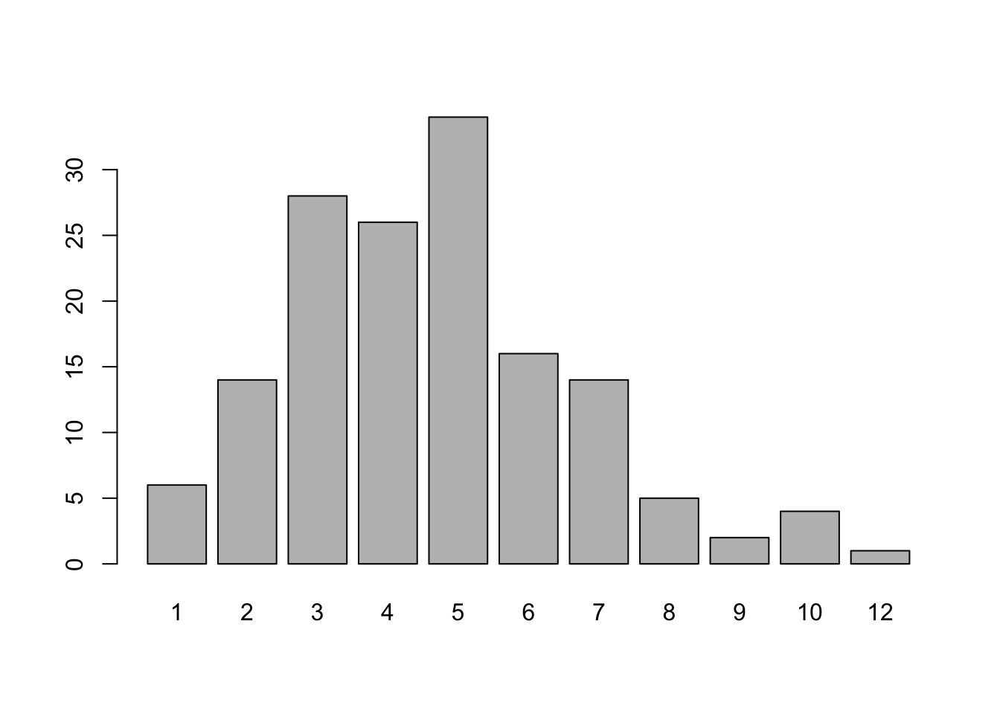

# Inicios

En este capítulo se mostrará cómo iniciar todo


```r
x <- rpois(n=150, lambda=5)
barplot(table(x))
```

<div class="figure">

<p class="caption">(\#fig:unnamed-chunk-1)Diagrama de barras</p>
</div>

