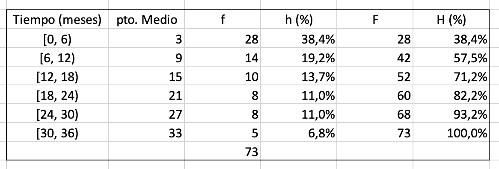
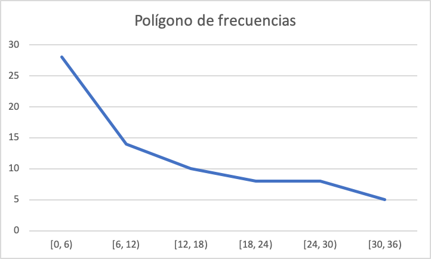
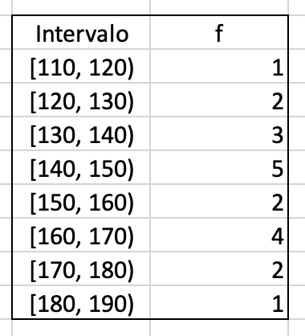

# Planteamiento de una investigación: Anatomía y Fisiología de la investigación

En este capítulo se resolverán problemas relativos a:

- Diseño de una investigación
- Métodos de muestreo
- Métodos de recolección de datos
- Variables y Escalas de Medida
- Errores en la Investigación

## Pregunta test

La proporción de individuos de una población que tiene una enfermedad en un momento dado de tiempo se denomina:

a) Incidencia acumulada
b) Densidad de incidencia
c) Fracción atribuible
d) Prevalencia
e) Odds ratio

<button onclick="f1()">Respuesta correcta</button>

[Explicación](https://www.cancer.gov/espanol/publicaciones/diccionarios/diccionario-cancer/def/prevalencia)

## Pregunta test

¿Cuál es el mejor tipo de estudio epidemiológico para estimar la prevalencia de una enfermedad crónica en una comunidad determinada?

a) Estudio ecológico
b) Ensayo clínico aleatorio
c) Estudio transversal de la población
d) Estudio de casos y controles
e) Estudio de cohortes

<button onclick="f1_1()">Respuesta correcta</button>

[Explicación](https://escuelitamedica.com/2019/02/03/tipos-de-estudios-epidemiologicos-preguntas/)

## Pregunta test

En una muestra de pacientes, el número de varones dividido entre el total de pacientes es:

a)	Una frecuencia relativa.
b)	Una frecuencia absoluta.
c)	Una variable cuantitativa.
d)	Una variable cualitativa.
e)	Un valor de la variable.

<button onclick="f2()">Respuesta correcta</button>

[Explicación](https://1fjmanzano.github.io/bioestadistica/tablas-de-frecuencias.html)

## Pregunta test

Señale cuál de las siguientes afirmaciones es falsa:

a)	La aparición o no de bacterias en un cultivo es una variable dicotómica
b)	La estatura de un individuo es una variable cuantitativa discreta.
c)	El lugar que ocupa una persona entre sus hermanos (de menor a mayor edad) es una variable ordinal.
d)	El estado civil es una variable cualitativa.
e)	La glucemia es continua.

<button onclick="f3()">Respuesta correcta</button>

[Explicación](https://1fjmanzano.github.io/bioestadistica/tipos-de-variables.html)

## Problema

En base a la siguiente distribución de frecuencias relativas acumuladas de la variable $X$ = "Número de contratos conseguidos en el mes de enero" obtenida de la observación de la actividad de 50 teleoperadores de
una compañía de telefonía móvil, indique el número mínimo de contratos que tiene que haber conseguido un teleoperador para estar entre los 5 que han destacado más:

|  $X_i$ |  58 |  60 |  62 |  65 |  68 |  70 |  71 |
|:-:|:-:|:-:|:-:|:-:|:-:|:-:|:-:|
| $H_i$  |  0.06 |  0.2 | 0.4  |  0.64 |  0.8 | 0.92  | 1  |

### Solución

Al haber 50 teleoperadores, si tiene que estar entre los 5 que han destacado mas, debe dejar a 45 por detrás. Como $\frac{45}{50}=0.9$, deberá superar al 90 %, es decir, estar por encima del 0.9 en la frecuencia relativa acumulada.

En la tabla vemos que para el valor 70 se alcanza la frecuencia relativa acumulada de 0.92 por lo que **para estar entre los 5 que más han destacado, deberá haber firmado, al menos, 70 contratos**.

## Pregunta test

¿A qué fase del proceso de investigación pertenece la recogida, análisis e interpretación de los resultados?

a) Fase conceptual.
b) Fase Metodológica.
c) Fase Empírica. 
d) Fase de análisis e interpretación de los datos.

<button onclick="f4()">Respuesta correcta</button>

[Explicación](https://www.salusplay.com/apuntes/apuntes-metodologia-de-la-investigacion/tema-4-el-proceso-de-investigacion-fases-de-realizacion-de-una-investigacion-cientifica/2)

## Pregunta test

La incidencia de una enfermedad es:

a) La relación entre enfermos y fallecidos
b) La prevalencia multiplicada por la morbilidad
c) Lo mismo que la prevalencia
d) El no de casos nuevos de esa enfermedad
e) Ninguna de las anteriores

<button onclick="f4_1()">Respuesta correcta</button>

[Explicación](https://medlineplus.gov/spanish/ency/article/002387.htm)

## Pregunta test

En el caso de una variable ordinal, el número n de datos válidos es:

a)	La suma de las frecuencias absolutas.
b)	La frecuencia absoluta acumulada de la categoría más frecuente.
c)	La suma de las frecuencias relativas.
d)	La frecuencia relativa acumulada en la última categoría.
e)	La (a) y la (d) son ciertas.

<button onclick="f5()">Respuesta correcta</button>

[Explicación](https://1fjmanzano.github.io/bioestadistica/tablas-de-frecuencias.html)

## Pregunta test

El nº de casos nuevos de una enfermedad que se desarrolla en una población en un periodo de tiempo determinado se conoce como:

a) Densidad de incidencia
b) Incidencia acumulada
c) Prevalencia
d) Fracción atribuible
e) Riesgo relativo

<button onclick="f5()">Respuesta correcta</button>

[Explicación](https://www.conprueba.es/glosario/incidencia-acumulada)

## Pregunta test

En un estudio sobre problemas cervicales preguntamos a los pacientes acerca del tipo de almohada que usan. Las respuestas deberían ser consideradas como una variable:

a)	Cualitativa nominal
b)	Numérica
c)	Discreta
d)	Continua.
e)	Ordinal

<button onclick="f6()">Respuesta correcta</button>

[Explicación](https://1fjmanzano.github.io/bioestadistica/tipos-de-variables.html)

## Pregunta test

Al inicio de un estudio de cohortes ¿cómo está la población a estudiar?

a) Todos los efectos del proceso que se estudia
b) Todos sanos
c) La cohorte expuesta sana y la no expuesta enferma
d) La cohorte expuesta enferma y la no expuesta sana
e) Ninguna de las anteriores

<button onclick="f6_1()">Respuesta correcta</button>

[Explicación](https://es.wikipedia.org/wiki/Estudio_de_cohorte)

## Problema

De la distribución de la variable  $X$ = 'Peso (en Kg)' de un colectivo de adolescentes agrupada en 4 intervalos con límites superiores 60, 65, 70 y 75 se sabe que: 

- la mitad del colectivo pesa entre 65 y 70 kg
- una cuarta parte pesa como máximo 65 kg
- 9 adolescentes tiene un peso máximo de 60 kg
- 18 pesan entre 70 y 75 kg.

Calcula

**a)** El número n de adolescentes entrevistados

**b)** El porcentaje de adolescentes que pesan entre 55 y 60 kg

**c)** El peso mínimo de la mitad de adolescentes con mayor peso

**d) ** Cuántos alumnos pesan como máximo, 65 kg

### Solución

Vemos que tenemos mucha información que conviene organizar en forma de tabla. Empezamos escribiendo una tabla con los datos que tenemos:

| Intervalo  |  $f_i$ | $h_i$ | $F_i$ | $H_i$ |
|:-:|:-:|:-:|:-:|:-:|
| $[55,60)$  | 9  |   | 9 |   |
| $[60,65)$  |   |   |   | 0.25 |
| $[65,70)$  |   | 0.50 |   |   |
| $[70,75)$  | 18 |  |   | 1 |

A partir de estos datos, vamos a completar el resto.

Como el 25 % pesan menos de 65 y el 50 % entre 65 y 70, entonces el 75 % pesarán menos de 70 kg y el 25 % pesarán más de 70 hg.

| Intervalo  |  $f_i$ | $h_i$ | $F_i$ | $H_i$ |
|:-:|:-:|:-:|:-:|:-:|
| $[55,60)$  | 9  |   | 9 |   |
| $[60,65)$  |   |   |   | 0.25 |
| $[65,70)$  |   | 0.50 |   | 0.75  |
| $[70,75)$  | 18 | 0.25 |   | 1 |

Así, el 25 % (la cuarta parte) del número n de adolescentes entrevistados es 18 por lo que $n = 18 \cdot 4 = 72$. El 50 % de 72 es 36 y, como hay 9 adolescentes entre 55 y 60 kg y como $72 - 9 - 36 - 18 = 9$, tendremos

| Intervalo  |  $f_i$ | $h_i$ | $F_i$ | $H_i$ |
|:-:|:-:|:-:|:-:|:-:|
| $[55,60)$  | 9  | 0.125  | 9 |  0.125 |
| $[60,65)$  | 9 |  0.125 |  18 | 0.25 |
| $[65,70)$  | 36  | 0.50 | 54  | 0.75  |
| $[70,75)$  | 18 | 0.25 |  72 | 1 |

Y a la vista de la tabla, podemos responder a las preguntas:

**a)** Se entrevistaron a 72 adolescentes

**b)** El 25 % de adolescentes pesa entre 55 y 60 kg

**c)** El 50 % de los adolescentes con mayor peso están en los intervalos $[65,70)$ y $[70,75)$ y, como no podemos saber exactamente cuál es el peso menor de ese 50 %, **el peso mínimo de la mitad de adolescentes con mayor peso es de, al menos, 65 kg**. 

**d)** 18 alumnos pesan como máximo 65 kg

## Pregunta test

¿Cuál de las siguientes características pertenece al paradigma naturalista?

a) Pretende buscar la objetividad.
b) El investigador interactúa con los sujetos investigados y los resultados se crean de esa interacción. 
c) Utilización de procesos deductivos.
d) Importancia en el análisis estadístico.

<button onclick="f7()">Respuesta correcta</button>

[Explicación](https://www.encyclo.co.uk/meaning-of-Naturalistic_paradigm)

## Pregunta test

En un estudio sobre la enfermedad coronaria en la población española, se selecciona una muestra de individuos hipertensos y un grupo de control de no hipertensos. Se les sigue durante 5 años y se compara la incidencia de la enfermedad de ambos grupos ¿A qué tipo de diseño corresponde el estudio?

a) Estudio de cohortes
b) Estudio de casos y controles
c) Estudio transversal
d) Ensayo clínico
e) Estudio ecológico

<button onclick="f7_1()">Respuesta correcta</button>

[Explicación](https://es.wikipedia.org/wiki/Estudio_de_cohorte)

## Pregunta test

El estudio estadístico en el que se pretenden extrapolar los datos de una muestra a la población se denomina:

a) Estadística descriptiva. 
b) Estadística inferencial.
c) Medidas de tendencia central.
d) Medidas de posición.

<button onclick="f8()">Respuesta correcta</button>

[Explicación](https://1fjmanzano.github.io/bioestadistica/inferencia-estad%C3%ADstica.html)

## Problema

Con el objetivo de programar las actividades en un consultorio se obtiene información del número de consultas realizadas el año anterior:

|  | Mujeres | Hombres |
|:-:|:-:|:-:|
| Intervalo | n | n |
| 1 - 3 | 18 | 22 |
| 4 - 6 | 39 | 31 |
| 7 - 9 | 53 | 46 |
| 8 - 10 | 45 | 40 |
| 11 - 13 | 53 | 35 |
| 14 - 16 | 39 | 29 |
| 17 - 20 | 18 | 26 |
| Total | 265 | 229 |

**a)**	Indique el (o los) nombre(s) de las(s) variables(s) de la tabla e identifique sus categorías.

**b)**	Indique el tipo de escala de las(s) variables (s) de la tabla.     

**c)**	¿Qué porcentaje de pacientes realiza, al menos, 8 consultas?

### Solución

**a)** La variable estudiada es **número de consultas realizadas el año anterior con 2 categorías, Mujeres y Hombres**.

**b)** Es una variable cualitativa discreta de escala ordinal con resultados agrupados en intervalos.

**c)** Para calcular el porcentaje pedido, vemos que:

- Mujeres con, al menos 8 consultas: $45 + 53 + 39 + 18 = 155$

- Hombres con, al menos 8 consultas: $40 + 35 + 29 + 26 = 130$

- Pacientes con, al menos 8 consultas: $155 + 130 = 285$

- Total de pacientes: $265 + 229 = 494$

Como $\dfrac{285}{494} \approx 0.577$, entonces **el 57.7 % de pacientes  realiza, al menos, 8 consultas**.

## Pregunta test

Elija la afirmación correcta sobre variables observadas en individuos:

a)	Poseer vivienda propia es una variable numérica.
b)	Poseer animales de compañía es una variable cualitativa.
c)	La nacionalidad es una variable ordinal.
d)	El tipo de almohada que usa es variable ordinal.
e)	La longitud de la cama donde duerme es variable discreta.

<button onclick="f9()">Respuesta correcta</button>

[Explicación](https://1fjmanzano.github.io/bioestadistica/tipos-de-variables.html)

## Pregunta test

La estadística en Ciencias de la Salud se utiliza para obtener información sobre situaciones de caracter:

a)	Determinista.
b)	Sistemático.
c)	Exhaustivo.
d)	Aleatorio.
e)	Excluyente.

<button onclick="f10()">Respuesta correcta</button>

[Explicación](https://1fjmanzano.github.io/bioestadistica/inferencia-estad%C3%ADstica.html)

## Pregunta test

Elija la afirmación que pueda considerarse admisible al leer un estudio estadístico:

a)	Se estudió a una muestra en vez de a la población, para mayor precisión.
b)	Se estudió a la población para obtener información sobre la muestra.
c)	Se estudió a una muestra representativa de la población.
d)	Se estudiaron todas las variables de la población.
e)	Se observó a un individuo de cada variable.

<button onclick="f11()">Respuesta correcta</button>

[Explicación](https://1fjmanzano.github.io/bioestadistica/me%CC%81todos-de-muestreo.html)

## Problema

En un estudio sobre supervivencia tras un tratamiento con quimioterapia para cierto tipo de cáncer ha sido registrado el tiempo transcurrido desde el inicio del tratamiento hasta el fallecimiento de los individuos. Los tiempos registrados se resumen en la tabla adjunta, agrupados por intervalos de 6 meses de amplitud:

**a)** Calcule las frecuencias relativas y porcentajes de los distintos intervalos.

**b)** Calcule los puntos medios de los intervalos.

**c)** Calcule las frecuencias absolutas y porcentajes acumulados

**d)** Construya el histograma, polígono de frecuencias y polígono acumulativo

### Solución

**a), b) y c)**

- f: frecuencias absolutas
- h: frecuencias relativas (porcentajes)
- F: frecuencias absolutas acumuladas
- H: frecuencias relativas acumuladas (en porcentaje)

Tabla construida siguiendo esta [Práctica con Excel© del Curso de Bioestadística](https://1fjmanzano.github.io/bioestadistica/tablas-de-frecuencias.html#tabla-de-frecuencias-pr%C3%A1ctica-con-excel)

**d)**

Gráfico construido siguiendo esta [Práctica con Excel© del Curso de Bioestadística](https://1fjmanzano.github.io/bioestadistica/histogramas.html#histogramas-con-excel-pr%C3%A1cticas)

Gráficos construidos siguiendo esta [Práctica con Excel© del Curso de Bioestadística](https://1fjmanzano.github.io/bioestadistica/nu%CC%81meros-i%CC%81ndices.html#n%C3%BAmeros-%C3%ADndices-pr%C3%A1ctica-con-excel)

## Pregunta test

Elija la afirmación correcta:

a)	Los valores de cualquier variable deben ser agrupados en intervalos.
b)	Las variables deben ofrecer valores que no se repitan en los diferentes individuos.
c)	Las modalidades de una variable deben poder ser observadas en todos los individuos.
d)	Los individuos pueden poseer diferentes modalidades de la misma variable.
e)	Todo lo anterior es falso.

<button onclick="f12()">Respuesta correcta</button>

[Explicación](https://1fjmanzano.github.io/bioestadistica/tipos-de-variables.html)

## Pregunta test

Elija la opción correcta.

a)	Un parámetro es algo calculado sobre cada individuo.
b)	Un parámetro es calculado sobre la muestra.
c)	Una variable se calcula sobre los parámetros de una población.
d)	Un estadístico se calcula sobre la población.
e)	Nada de lo anterior es correcto.

<button onclick="f13()">Respuesta correcta</button>

[Explicación](https://1fjmanzano.github.io/bioestadistica/conceptos-previos.html)

## Pregunta test

Disponemos de la distribución de edades de los individuos de una población. El número de ellos que no es mayor de edad, es:

a)	Una frecuencia relativa.
b)	Una frecuencia absoluta.
c)	Una frecuencia acumulada.
d)	Una variable numérica.
e)	Una variable cualitativa.

<button onclick="f14()">Respuesta correcta</button>

[Explicación](https://1fjmanzano.github.io/bioestadistica/tablas-de-frecuencias.html)

## Pregunta test

¿Cuál de las siguientes no es una característica de los estudios de cohortes?

a) Son estudios observacionales
b) El criterio de selección de los sujetos es la presencia o no de cnfermedad
d) Son estudios longitudinales
e) Pueden ser prospectivos o retrospectivos
5) Tienen direccionalidad hacia delante

<button onclick="f14_1()">Respuesta correcta</button>

[Explicación](https://es.wikipedia.org/wiki/Estudio_de_cohorte)

## Problema

Los datos  corresponden a las medidas de tensión arterial sistólica (en mm/Hg) registradas sobre 20 individuos fumadores de más de una cajetilla de cigarrillos diaria:

145, 185, 120, 160, 165, 160, 175, 145, 145, 175, 130, 130, 120, 110, 145, 150, 155, 160, 145, 135

**a)** Construya la tabla de distribución de frecuencias para los datos originales.

**b)** Construya la tabla de distribución de frecuencias por intervalos de amplitud 10 mm/Hg.

**c)** Grafique la distribución de la variable.

#Solución

**a)**

Contando *con papel y boli*:

| Tensión | 110 | 120 | 130 | 135 | 145 | 150 | 155 | 160 | 165 | 175 | 185 |
|:-:|:-:|:-:|:-:|:-:|:-:|:-:|:-:|:-:|:-:|:-:|:-:|
| f | 1 | 2 | 2  | 1 | 5  | 1  | 1  | 3  | 1  | 2 | 1 |

**b)**

Se pide ahora considerar intervalos de amplitud 10 mm/Hg. Como el mínimo es 110 y el máximo 185, establecemos 8 intervalos:

Tabla construida siguiendo esta [Práctica con Excel© del Curso de Bioestadística](https://1fjmanzano.github.io/bioestadistica/tablas-de-frecuencias.html#tablas-de-frecuencias-pr%C3%A1ctica-3-con-excel) 

**c)** Al tener los datos en intervalos, utilizamos un histograma:

Gráfico construido siguiendo esta [Práctica con Excel© del Curso de Bioestadística](https://1fjmanzano.github.io/bioestadistica/histogramas.html#histogramas-con-excel-pr%C3%A1cticas)

## Pregunta test

Conocemos la distribución de estudiantes entre las distintas facultades del campus Viriato. El número de estudiantes de Enfermería es:

a)	Una frecuencia relativa.
b)	Una frecuencia absoluta.
c)	Una frecuencia acumulada.
d)	Un porcentaje.
e)	Una variable cualitativa.

<button onclick="f15()">Respuesta correcta</button>

[Explicación](https://1fjmanzano.github.io/bioestadistica/tablas-de-frecuencias.html)

## Pregunta test

Se llama parámetro a:

a)	Una función de valor numérico definida sobre alguna característica observable en los individuos de una población.
b)	Una función definida sobre los valores numéricos de una muestra.
c)	Cualquier variable observable de una población
d)	Las variables numéricas de la muestra
e)	Cualquier función sobre las variables observadas

<button onclick="f16()">Respuesta correcta</button>

[Explicación](https://1fjmanzano.github.io/bioestadistica/conceptos-previos.html)

## Pregunta test

Respecto a los estudios de casos y controles es cierto que:

a) Se analizan comparando la incidencia de una enfermedad o proceso en el grupo de casos respecto al grupo de controles
b) Pueden escogerse varios controles para cada caso
c) Una de las medidas de asociación que puede calcularse directamente en su análisis es el riesgo relativo
d) Se denominan también estudios de prevalencia
e) Es preferible seleccionar casos prevalentes en vez de casos incidentes de la enfermedad o proceso en estudio

<button onclick="f16_1()">Respuesta correcta</button>

[Explicación](https://dsp.facmed.unam.mx/wp-content/uploads/2022/02/Anexo-1C-U-9-Estudios-de-casos-y-controles.-Argimon-J.pdf)

## Pregunta test

El grado de satisfacción (poco/regular/mucho) con la política española la trataría como:

a)	una variable cualitativa nominal.
b)	una variable cuantitativa discreta.
c)	una variable cualitativa ordinal.
d)	una variable numérica continua.
e)	ninguna de las anteriores es correcta.

<button onclick="f17()">Respuesta correcta</button>

[Explicación](https://1fjmanzano.github.io/bioestadistica/tipos-de-variables.html)

## Pregunta test

Con respecto a la modalidades de una variable cualquiera:

a)	Pueden siempre agruparse en clases.
b)	Deben formar un sistema exhaustivo.
c)	No pueden agruparse en intervalos.
d)	No tienen porqué formar un sistema excluyente.
e)	Solo dos son correctas.

<button onclick="f18()">Respuesta correcta</button>

[Explicación](https://1fjmanzano.github.io/bioestadistica/tipos-de-variables.html)

## Pregunta test

¿Cuál es el estudio de elección para evaluar la eficacia de un nuevo tratamiento?

a) Estudio de casos y controles
b) Ensayo clínico aleatorio
c) Estudio transversal
d) Estudio de morbilidad
e) Estudio de cohortes

<button onclick="f18_1()">Respuesta correcta</button>

[Explicación](https://www.cancer.gov/espanol/publicaciones/diccionarios/diccionario-cancer/def/ensayo-clinico-aleatorizado)

## Pregunta test

Cuando hablamos de número de cumpleaños que ha tenido una persona estamos ante:

a)	Una variable cualitativa ordinal.
b)	Una variable cualitativa nominal.
c)	Una variable cuantitativa discreta.
d)	Una variable cuantitativa continua.
e)	El número de cumpleaños no es una variable.

<button onclick="f19()">Respuesta correcta</button>

[Explicación](https://1fjmanzano.github.io/bioestadistica/tipos-de-variables.html)

## Pregunta test

Las pruebas de cribado son una actividad de:

a) Prevención primaria
b) Prevención secundaria
c) Prevención terciaria
d) Promoción de la salud
e) Prevención primaria y promoción de la salud

<button onclick="f19_1()">Respuesta correcta</button>

[Explicación](https://es.wikipedia.org/wiki/Prevención_secundaria)

## Pregunta test

Las frecuencias acumuladas tienen sentido para:

a)	Variables ordinales
b)	Variables numéricas
c)	Variables nominales
d)	Todas son correctas.
e)	Las opciones a) y b) son correctas.

<button onclick="f20()">Respuesta correcta</button>

[Explicación](https://1fjmanzano.github.io/bioestadistica/tablas-de-frecuencias.html)

## Pregunta test

Señale la respuesta INCORRECTA respecto a los estudios de cohortes:

a) Pueden ser prospectivos y retrospectivos
b) Son estudios observacionales y descriptivos
c) Permiten establecer con claridad la secuencia temporal de los eventos de interés
d) Permiten medir la incidencia de la enfermedad
e) Permite medir los efectos de exposiciones infrecuentes en la población

<button onclick="f20_1()">Respuesta correcta</button>

[Explicación](https://es.wikipedia.org/wiki/Estudio_de_cohorte)

## Pregunta test

Disponemos de la distribución de edades de los individuos de una población. El número de ellos que tiene dos o menos hijos es:

a)	Una variable cualitativa.
b)	Una variable numérica.
c)	Una frecuencia acumulada.
d)	Son correctas a) y b)
e)	Ninguna es correcta.

<button onclick="f21()">Respuesta correcta</button>

[Explicación](https://1fjmanzano.github.io/bioestadistica/tablas-de-frecuencias.html)

## Pregunta test

Los principales objetivos de la estadística descriptiva son:

a) Sintetizar la información contenida en los datos.
b) Aportar resúmenes significativos de las distribuciones.
c) Contribuye a la realización de los posteriores análisis estadísticos.
d) Todos son correctos. 

<button onclick="f22()">Respuesta correcta</button>

[Explicación](https://1fjmanzano.github.io/bioestadistica/an%C3%A1lisis-exploratorio-de-datos.html)

## Pregunta test

Se diseña un estudio para evaluar el efecto sobre la salud de la exposición a los teléfonos móviles en el que durante 10 años se sigue a una población inicialmente sana ¿Qué tipo de diseño tiene ese estudio?

a) Estudio casos y controles
b) Estudio de cohortes
c) Estudio transversal 
d) Estudio de casos 
e) Ensayo controlado

<button onclick="f22_1()">Respuesta correcta</button>

[Explicación](https://es.wikipedia.org/wiki/Estudio_de_cohorte)

## Pregunta test

En un estudio sobre las causas del cáncer de pulmón se compararon los antecedentes de tabaquismo en los pacientes que habían desarrollado esta enfermedad con los de un grupo de personas y en la enfermedad ¿de qué tipo de estudio epidemiológico se trata?

a) Estudio de casos y controles
b) Estudio de cohortes
c) Ensayo clínico aleatorio
d) Estudio ecológico
e) Estudio transversal

<button onclick="f22_2()">Respuesta correcta</button>

[Explicación](http://www.scielo.org.pe/scielo.php?script=sci_arttext&pid=S2308-05312020000100138)

## Pregunta test

El tipo de variable cualitativa que sus valores o categorías no pueden ser ordenados, se denomina:

a) Variable ordinal.
b) Variable discreta.
c) Variable nominal. 
d) Variable continua.

<button onclick="f23()">Respuesta correcta</button>

[Explicación](https://1fjmanzano.github.io/bioestadistica/tipos-de-variables.html)

## Pregunta test

¿A qué fase del proceso de investigación pertenece la relación de los objetivos e hipótesis de la investigación?

a) Fase conceptual. 
b) Fase Metodológica.
c) Fase Empírica.
d) Fase de análisis e interpretación de los datos.

<button onclick="f24()">Respuesta correcta</button>

[Explicación](https://www.salusplay.com/apuntes/apuntes-metodologia-de-la-investigacion/tema-4-el-proceso-de-investigacion-fases-de-realizacion-de-una-investigacion-cientifica/2)

## Pregunta test

Cuál es el estudio de elección para evaluar si existe una relación causa-efecto entre un factor y una enfermedad poco frecuente?

a) Transversal
b) Casos y controles
c) Cohortes
d) Serie de casos clínicos
e) Correlaciones temporales

<button onclick="f24_1()">Respuesta correcta</button>

[Explicación](http://www.scielo.org.pe/scielo.php?script=sci_arttext&pid=S2308-05312020000100138)

## Pregunta test

Para tratar de establecer una relación causal entre el consumo de benzodiacepinas durante el embarazo y el riesgo de fisura palatina en el recién nacido se seleccionan madres de recién nacidos con fisura palatina y se compararon con madres de recién nacidos sanos en cuanto a los antecedentes de toma de benzodiacepinas ¿cuál es el tipo de diseño de estudio empleado?

a) Casos y controles
b) Estudio de cohortes
c) Ensayo clínico aleatorizado
d) Estudio ecológico
e) Ensayo clínico cruzado

<button onclick="f25()">Respuesta correcta</button>

[Explicación](http://www.scielo.org.pe/scielo.php?script=sci_arttext&pid=S2308-05312020000100138)

## Pregunta test

Un estudio en el que los participantes se asignan al azar para recibir un nuevo tratamiento o placebo se denomina:

a) Cohortes
b) Casos y controles
c) Transversal
d) Ensayo clínico
e) Serie de casos clínicos

<button onclick="f26()">Respuesta correcta</button>

[Explicación](https://www.geicam.org/que-hacemos/ensayos-clinicos/que-es-un-ensayo-clinico)

## Pregunta test

¿Cómo se denomina el ensayo clínico en el que los pacientes, los investigadores y los profesionales sanitarios implicados sanitarios implicados en la atención de los pacientes desconocen el tratamiento asignado?

a) Enmascaramiento
b) Triple ciego
c) Abierto
d) Simple ciego
e) Doble ciego

<button onclick="f27()">Respuesta correcta</button>

[Explicación](http://cv.uoc.edu/UOC/a/moduls/90/90_166d/web/main/m4/22d.html)

