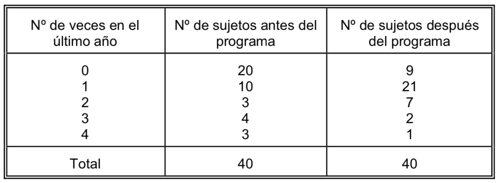
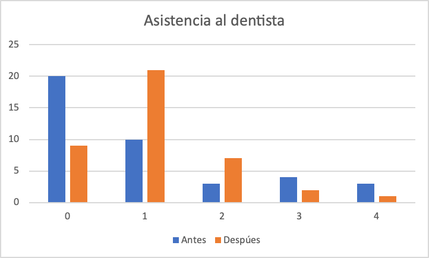
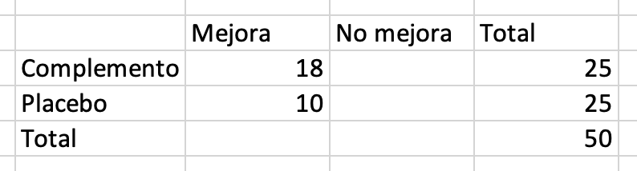
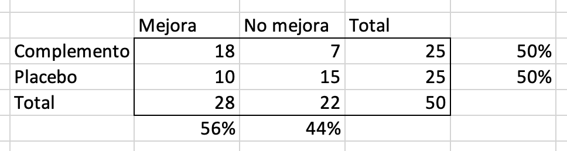

# Análisis Descriptivo y Gráfico de datos cuantitativos

En este capítulo se resolverán problemas relativos a:

- Medidas de tendencia central: Media, Moda, Mediana.
- Medidas de dispersión: Recorrido, Varianza, Desviación típica, Coeficiente de variación, Recorrido intercuartílico. Error estándar.
- Representaciones gráficas: Diagrama de barras, Pictogramas, Cartogramas, 

## Pregunta test

Cuál de las siguientes medidas define mejor la tendencia central de los datos: 5 , 4, 42, 4, 6

a)	La mediana.
b)	La media.
c)	El sesgo
d)	El rango.
e)	La proporción.

<button onclick="f1()">Respuesta correcta</button>

[Explicación](https://1fjmanzano.github.io/bioestadistica/medidas-de-posicio%CC%81n-dispersio%CC%81n-y-forma.html#medidas-de-posicio%CC%81n-centrales)

## Pregunta test

Los diagramas de sectores son muy útiles para comparar:

a)	Dos variables cualitativas en una población.
b)	Dos variables cuantitativas en una población.
c)	Una variable cualitativa en dos poblaciones.
d)	Una variable cuantitativa en dos poblaciones.
e)	Una variable cuantitativa con otra cualitativa.

<button onclick="f2()">Respuesta correcta</button>

[Explicación](https://1fjmanzano.github.io/bioestadistica/diagramas-de-barras-y-sectores.html)

## Problema

El siguiente polígono de frecuencias absolutas acumuladas corresponde a la distribución de frecuencias de la variable $X$ ="Duración en minutos de una consulta médica especializada".

**a)** ¿Qué porcentaje de consultas han durado como máximo 30 minutos?

**b)** ¿Qué porcentaje de consultas han durado entre 25 y 30 minutos?

### Solución

Al ser un polígono de frecuencias absolutas acumuladas, vemos que se han contabilizado un total de 350 consultas.

**a)** Vemos que hay 200 consultas que han durado como máximo 30 minutos. Como $\frac{200}{350} \approx 0.57$, entonces **un 57 % de las consultas han durado entre 25 y 30 minutos**.

**b)** Entre 25 y 30 minutos, han habido $200 - 150 = 50$ consultas. Como $\frac{50}{350} \approx 0.14$, **un 14 % de las  consultas han durado entre 25 y 30 minutos**

## Pregunta test

En cuanto a la presentación ordenada del estudio de una variable aislada:

a)	Lo más informativo es mostrar las medidas de tendencia central.
b)	Lo más informativo es mostrar las medidas de dispersión.
c)	Se deben presentar todos los valores observados de la variable, uno a uno, de menor a mayor.
d)	Las representaciones gráficas dan más información que las tablas de frecuencia.
e)	A veces no tiene sentido usar frecuencias acumuladas.

<button onclick="f3()">Respuesta correcta</button>

[Explicación](https://1fjmanzano.github.io/bioestadistica/otros-gra%CC%81ficos.html)

## Pregunta test

La mediana es una medida de tendencia central que se usa cuando:

a) Los datos son impares.
b) La muestra es asimétrica.
c) La muestra es heterogénea.
d) La muestra es simétrica.
e) La muestra es homogénea.

<button onclick="f3_1()">Respuesta correcta</button>

[Explicación](https://1fjmanzano.github.io/bioestadistica/medidas-de-posicio%CC%81n-dispersio%CC%81n-y-forma.html#medidas-de-posicio%CC%81n-centrales)

## Pregunta test

El Coeficiente de Variación se calcula:

a) Multiplicando la Varianza por la Media.
b) Dividiendo la Desviación Típica por la Media.
c) Dividiendo la Media por la Desviación Típica.
d) Dividiendo la Media por la Varianza.
e) Multiplicando la Desviación Típica por la Media.

<button onclick="f3_2()">Respuesta correcta</button>

[Explicación](https://es.wikipedia.org/wiki/Coeficiente_de_variación)

## Pregunta test

En las representaciones gráficas de variables cualitativas, la regla fundamental a tener en cuenta es:

a)	Las alturas en cada modalidad son proporcionales al valor de la variable.
b)	Las áreas para cada modalidad son proporcionales al valor de la variable.
c)	Las áreas para cada modalidad son proporcionales a las frecuencias acumuladas.
d)	Las áreas para cada modalidad son proporcionales a las frecuencias absolutas o relativas.
e)	Las alturas para cada modalidad son proporcionales a las frecuencias acumuladas.

<button onclick="f4()">Respuesta correcta</button>

[Explicación](https://1fjmanzano.github.io/bioestadistica/diagramas-de-barras-y-sectores.html)

## Problema

En un estudio para evaluar la eficacia de cierto programa educativo sobre salud bucodental, se preguntó a los asistentes con qué frecuencia acudían al dentista por razones preventivas. Dos años después del programa educativo se volvió a preguntar a los asistentes al programa la misma pregunta. En la tabla adjunta se describen los resultados obtenidos:

Construya los diagramas de barras representando gráficamente las distribuciones del número de veces que fueron al dentista en el último año, antes y después del programa educativo. Compare los resultados.

### Solución

Gráfico construido siguiendo esta [Práctica con Excel© del Curso de Bioestadística](https://1fjmanzano.github.io/bioestadistica/diagramas-de-barras-y-sectores.html)

Vemos que, antes de participar en el programa, la mayoría de participantes o no acudía al dentista o lo hacía una vez al año. Tras el programa, vemos que ha disminuido drásticamente el número de personas que no acuden al dentista pasando a ser la mayoría los que acuden 1 o 2 veces.

Se observa que, tras el programa, bajan los participantes que acudían 3 o 4 veces.

## Pregunta test

Entre las representaciones gráficas para variables cualitativas tenemos:

a)	Histogramas.
b)	Diagramas integrales.
c)	Diagramas diferenciales.
d)	Diagramas de cajas y bigotes.
e)	Nada de lo anterior.

<button onclick="f5()">Respuesta correcta</button>

d) [Explicación](https://1fjmanzano.github.io/bioestadistica/diagramas-de-barras-y-sectores.html)

## Pregunta test

De los siguientes conceptos indique el que no tenga sentido:

a)	Diagrama de barras para la variable "Grupo sanguíneo"
b)	Pictograma para la variable "Altura"
c)	Diagrama integral para la variable "Nivel de colesterol"
d)	Diagrama de sectores para la variable "Sexo"
e)	Histograma para la variable "Peso"

<button onclick="f6()">Respuesta correcta</button>

[Explicación](https://1fjmanzano.github.io/bioestadistica/otros-gra%CC%81ficos.html)

## Problema

Investigadores de un centro hospitalario planificaron un estudio para determinar la eficacia de cierto complemento dietético en el tratamiento de la artritis reumatoide. El estudio se realizó sobre 50 pacientes con esta enfermedad, administrando a la mitad el complemento dietético y al resto un placebo durante veinte semanas. De los 25 pacientes que recibieron en complemento dietético, 18 presentaron mejoría, mientras que esto ocurrió en 10 de los que recibieron el placebo. Estructure los datos en una tabla de distribución de frecuencias conjuntas y calcule e interprete los porcentajes por filas y columnas.

### Solución

Comenzamos escrbiendo la tabla de doble entrada con las variables y los datos proporcionados:

Completamos los datos y añadimos los prcentajes por filas y columnas.

A la vista de los datos por filas, vemos que se sumistró a la mitad de los participantes el complemento dietético y a la otra mitad el placebo (50 % vs 50 %). Por columnas, vemos que un 56 % de participantes mejoran frente a un 44 % que no lo hacen. Esta diferencia es debida, sobre todo, al grupo que recibió el complemento donde la mejoría es bastante mayor que en el grupo que recibió el placebo (18 vs 10).

## Pregunta test

Si queremos representar gráficamente los porcentajes de una variable cuantitativa continua debemos usar:

a)	Pictogramas
b)	Diagrama de barras
c)	Diagrama diferencial acumulado
d)	Histograma
e)	No existe gráfica posible

<button onclick="f7()">Respuesta correcta</button>

[Explicación](https://1fjmanzano.github.io/bioestadistica/histogramas.html)

## Pregunta test

Los gráficos indicados para variables cualitativas son:

a)	Los diagramas de barras y los histogramas
b)	Los diagramas de barras, los de sectores y los pictogramas
c)	Los histogramas y pictogramas
d)	Sólo los diagramas de barras
e)	Los diagramas integrales

<button onclick="f8()">Respuesta correcta</button>

[Explicación](https://1fjmanzano.github.io/bioestadistica/diagramas-de-barras-y-sectores.html)

## Pregunta test

¿Qué gráfico elegirías para representar una las respuestas a una encuesta sobre el número de hijos que tiene la población?

a)	Histograma
b)	Diagrama de sectores
c)	Pictograma
d)	Diagrama de Barras
e)	Ninguna de las anteriores

<button onclick="f9()">Respuesta correcta</button>

[Explicación](https://1fjmanzano.github.io/bioestadistica/diagramas-de-barras-y-sectores.html)

## Pregunta test

Para comparar la variabilidad relativa de la tensión arterial diastólica y el nivel de colesterol en sangre de una serie de individuos, utilizamos

a)	Las desviaciones típicas.
b)	Los rangos.
c)	Los coeficientes de variación.
d)	La diferencia de las medias.
e)	La diferencia de las varianzas.

<button onclick="f10()">Respuesta correcta</button>

[Explicación](https://1fjmanzano.github.io/bioestadistica/medidas-de-posicio%CC%81n-dispersio%CC%81n-y-forma.html)

## Pregunta test

La media aritmética de una variable cuantitativa:

a)	Es siempre un valor de la variable.
b)	No tiene sentido calcularla para variables discretas.
c)	Es el valor más representativo de una modalidad.
d)	Si la variable es discreta, puede no ser única.
e)	Existe siempre.

<button onclick="f11()">Respuesta correcta</button>

[Explicación](https://1fjmanzano.github.io/bioestadistica/medidas-de-posicio%CC%81n-dispersio%CC%81n-y-forma.html#medidas-de-posicio%CC%81n-centrales)

## Pregunta test

Las siguientes medidas son todas de centralización, excepto:

a)	La media.
b)	La moda.
c)	La mediana.
d)	Rango intercuartílico.
e)	El percentil 50.

<button onclick="f12()">Respuesta correcta</button>

[Explicación](https://1fjmanzano.github.io/bioestadistica/medidas-de-posicio%CC%81n-dispersio%CC%81n-y-forma.html#medidas-de-posicio%CC%81n-centrales)

## Pregunta test

En un estudio descriptivo se obtiene una que el peso tiene una media de 60 kg y una desviación típica de 20 kg., mientras que la media de las edades es 15 años, con una desviación típica de 5 años. Entonces:

a)	Hay más dispersión en pesos que en edades.
b)	Hay más dispersión en edades que en pesos.
c)	Peso y edad están dispersos de modo equivalente.
d)	No tiene sentido compararlos al no coincidir las unidades de medida.
e)	Para comparar ambas dispersiones debemos usar la covarianza.

<button onclick="f13()">Respuesta correcta</button>

[Explicación](https://1fjmanzano.github.io/bioestadistica/medidas-de-posicio%CC%81n-dispersio%CC%81n-y-forma.html)

## Pregunta test

¿Cuál de las siguientes características no se corresponde con el concepto de mediana?

a)	Es el centro de gravedad de la distribución.
b)	No se ve afectada por los valores extremos.
c)	Deja por debajo el mismo número de datos que por encima.
d)	Es el segundo cuartil.
e)	Todo lo anterior se corresponde con la mediana.

<button onclick="f14()">Respuesta correcta</button>

[Explicación](https://1fjmanzano.github.io/bioestadistica/medidas-de-posicio%CC%81n-dispersio%CC%81n-y-forma.html#medidas-de-posicio%CC%81n-centrales)

## Pregunta test

Señale cuál de las siguientes afirmaciones es falsa:

a)	La media aritmética es siempre el centro de gravedad de la distribución.
b)	En una distribución continua simétrica, media y mediana coinciden.
c)	La media aritmética cambia cuando cambia algún dato.
d)	La mediana no siempre cambia cuando lo hace algún dato.
e)	En las distribuciones continuas simétricas todas las medidas de centralización coinciden.

<button onclick="f15()">Respuesta correcta</button>

[Explicación](https://www.statisticshowto.com/what-is-a-bimodal-distribution/)

## Pregunta test

El coeficiente de variación:

a)	Permite comparar la dispersión de dos poblaciones.
b)	Es menor que la media.
c)	Es menor que la desviación típica.
d)	No depende de la media ni la desviación típica.
e)	Depende de la escala que se use al medir la variable.

<button onclick="f16()">Respuesta correcta</button>

[Explicación](https://en.wikipedia.org/wiki/Coefficient_of_variation)

## Pregunta test

Se pide a unos enfermos que valoren su grado de mejoría tras un tratamiento en una escala de 1 a 5. De la siguiente colección de posibilidades, cuál cree que resume mejor los mismos:

a)	Media, Mediana y Moda.
b)	Percentil 25, Percentil 50, Percentil 75.
c)	Media y desviación típica.
d)	Mediana y desviación típica.
e)	Rango

<button onclick="f17()">Respuesta correcta</button>

[Explicación](https://1fjmanzano.github.io/bioestadistica/medidas-de-posicio%CC%81n-dispersio%CC%81n-y-forma.html#medidas-de-dispersio%CC%81n) 

## Pregunta test

De las siguientes medidas, cuáles podria utilizar para argumentar en favor o en contra de la asimetría de la variable edad:

a)	Percentil 25 y percentil 75.
b)	Media y Percentil 60.
c)	Media y mediana
d)	Media y desviación típica.
e)	Ninguna de las anteriores.

<button onclick="f18()">Respuesta correcta</button>

[Explicación](https://1fjmanzano.github.io/bioestadistica/medidas-de-forma.html)

## Pregunta test

La pregunta: ¿qué nivel de colesterol sólo es superado por el 5% de los individuos?, tiene por respuesta:

a)	El percentil 95.
b)	El percentil 5.
c)	Los percentiles 2,5 y 97,5
d)	95%.
e)	Nada de lo anterior.

<button onclick="f19()">Respuesta correcta</button>

[Explicación](https://1fjmanzano.github.io/bioestadistica/medidas-de-posicio%CC%81n-dispersio%CC%81n-y-forma.html#medidas-de-posicio%CC%81n-no-centrales)

## Pregunta test

Qué peso no llega a alcanzar el 40% de los individuos de una población:

a)	El 40%.
b)	El 60%.
c)	El percentil 60.
d)	El percentil 40.
e)	Los percentiles 20 y 60.

<button onclick="f20()">Respuesta correcta</button>

[Explicación](https://1fjmanzano.github.io/bioestadistica/medidas-de-posicio%CC%81n-dispersio%CC%81n-y-forma.html#medidas-de-posicio%CC%81n-no-centrales)

## Pregunta test

La media aritmética de una variable discreta:

a)	Puede ser un valor de la variable.
b)	No debería ser utilizada como medida de centralización.
c)	Es lo mismo que el percentil 50.
d)	Puede no ser única.
e)	Todo lo anterior es falso.

<button onclick="f21()">Respuesta correcta</button>

[Explicación](https://1fjmanzano.github.io/bioestadistica/medidas-de-posicio%CC%81n-dispersio%CC%81n-y-forma.html#medidas-de-posicio%CC%81n-centrales)

## Pregunta test

Se pregunta a los individuos su opinión sobre una cuestión, pudiendo valorar estos su respuesta en términos de: en contra, en parte a favor, muy a favor, totalmente de acuerdo. Elija la afirmación correcta:

a)	Podemos calcular la media.
b)	Podemos calcular el coeficiente de variación.
c)	La variable es de tipo ordinal
d)	La variable es de tipo cualitativo nominal.
e)	Nada de lo anterior es cierto.

<button onclick="f22()">Respuesta correcta</button>

[Explicación](https://1fjmanzano.github.io/bioestadistica/tipos-de-variables.html)

## Pregunta test

En una población, el 70% de las alturas consideradas "más normales" se encuentran:

a)	Por encima del percentil 70.
b)	Por debajo del cuantil 0,30
c)	Entre el percentil 30 y el 70
d)	Entre el percentil 15 y el 85.
e)	Entre la media y la mediana.

<button onclick="f23()">Respuesta correcta</button>

[Explicación](https://1fjmanzano.github.io/bioestadistica/distribuciones-de-probabilidad.html#distribucio%CC%81n-normal)

## Pregunta test

Las medidas de centralización, en cuanto a la información que ofrecen sobre una variable numérica, preferimos (por orden, de peor a mejor):

a)	media, mediana, moda
b)	moda, media, mediana
c)	media, moda, mediana.
d)	No se puede en general recomendar una como mejor que las otras.
e)	Todo lo anterior es falso.

<button onclick="f24()">Respuesta correcta</button>

[Explicación](https://1fjmanzano.github.io/bioestadistica/medidas-de-posicio%CC%81n-dispersio%CC%81n-y-forma.html#medidas-de-posicio%CC%81n-centrales)

## Pregunta test

Si una muestra posee valores anómalos, de las siguientes cuál usarías como medida de dispersión:

a)	Varianza.
b)	Desviación típica.
c)	Rango intercuartílico.
d)	Rango.
e)	Máximo y coeficiente de variación.

<button onclick="f25()">Respuesta correcta</button>

[Explicación](https://1fjmanzano.github.io/bioestadistica/medidas-de-posicio%CC%81n-dispersio%CC%81n-y-forma.html#medidas-de-dispersio%CC%81n)

## Pregunta test

Si queremos saber cómo de disperso está una variable relativamente con respecto a la magnitud de los valores centrales de la misma, usaremos:

a)	Varianza.
b)	Desviación típica.
c)	Rango intercuartílico.
d)	Rango.
e)	Coeficiente de variación.

<button onclick="f26()">Respuesta correcta</button>

[Explicación](https://en.wikipedia.org/wiki/Coefficient_of_variation)

## Pregunta test

Si el coeficiente de asimetría en una población presenta el valor 0,99 entonces:

a)	La distribución presenta una cola a la derecha.
b)	La distribución presenta una cola a la izquierda.
c)	La distribución es más apuntada que la normal.
d)	La distribución es menos apuntada que la normal.
e)	La distribución es prácticamente simétrica.

<button onclick="f27()">Respuesta correcta</button>

[Explicación](https://1fjmanzano.github.io/bioestadistica/medidas-de-forma.html)

## Pregunta test

Si la media del peso en una población es 60 kg. y la mediana 65kg., entonces afirmamos que la distribución del peso en la población es:

a)	Platicúrtica.
b)	Mesocúrtica.
c)	Leptocúrtica.
d)	Asimétrica.
e)	Unimodal.

<button onclick="f28()">Respuesta correcta</button>

[Explicación](https://1fjmanzano.github.io/bioestadistica/medidas-de-forma.html)

## Pregunta test

Si el coeficiente de asimetría en una población presenta el valor -5,22 entonces:

a)	La distribución presenta una cola a la derecha.
b)	La distribución presenta una cola a la izquierda.
c)	La distribución es más apuntada que la normal.
d)	La distribución es menos apuntada que la normal.
e)	Ese valor de asimetría es imposible.

<button onclick="f29()">Respuesta correcta</button>

[Explicación](https://1fjmanzano.github.io/bioestadistica/medidas-de-forma.html)

## Pregunta test

Medimos el número de glóbulos rojos y el de blancos en cada individuo de una población. Se observa determinada variabilidad en esas cantidades. Queremos saber de qué tipo de célula se presenta mayor variabilidad

a)	Compararemos las desviaciones típicas.
b)	Compararemos los rangos.
c)	Estudiaremos la covarianza.
d)	Estudiaremos el coeficiente de correlación lineal de Pearson.
e)	Compararemos los coeficientes de variación.

<button onclick="f30()">Respuesta correcta</button>

e) [Explicación](https://en.wikipedia.org/wiki/Coefficient_of_variation)

## Pregunta test

En una muestra de 1000 mujeres se estudia su número de hijos. Si quiero tener el máximo de información sobre la variable del estudio, preferimos:

a)	Media, Mediana y Moda.
b)	Percentil 25, Percentil 50, Percentil 75.
c)	Media y desviación típica.
d)	Media, mediana, cuartiles, asimetría, curtosis y desviación típica.
e)	Distribución de frecuencias

<button onclick="f31()">Respuesta correcta</button>

[Explicación](https://1fjmanzano.github.io/bioestadistica/tablas-de-frecuencias.html)

## Pregunta test

El 3% de los individuos tiene una altura superior a 190cm. El 5% mide menos de 150cm. Conocemos:

a)	El percentil 3
b)	El cuantil 0,06
c)	El percentil 95
d)	El percentil 97
e)	Nada de lo anterior.

<button onclick="f32()">Respuesta correcta</button>

[Explicación](https://1fjmanzano.github.io/bioestadistica/medidas-de-posicio%CC%81n-dispersio%CC%81n-y-forma.html#medidas-de-posicio%CC%81n-no-centrales)

## Pregunta test

Respecto a las medidas de centralización:

a)	La media no debe usarse en distribuciones muy asimétricas.
b)	La moda puede no ser única.
c)	En distribuciones simétricas media, mediana y moda coinciden.
d)	Las tres anteriores son correctas.
e)	Sólo la a) y la b) son correctas

<button onclick="f33()">Respuesta correcta</button>

[Explicación1](https://1fjmanzano.github.io/bioestadistica/medidas-de-forma.html) y [Explicación2](https://www.statisticshowto.com/what-is-a-bimodal-distribution/)

## Pregunta test

El coeficiente de asimetría en una población vale 3. Elija la afirmación correcta:

a)	La distribución presenta una cola a la derecha.
b)	La distribución presenta una cola a la izquierda.
c)	La distribución es simétrica.
d)	La distribución es más apuntada que la normal
e)	La media es igual a la mediana.

<button onclick="f34()">Respuesta correcta</button>

[Explicación](https://1fjmanzano.github.io/bioestadistica/medidas-de-forma.html)

## Pregunta test

¿Cuál de las siguientes medidas define mejor la tendencia central de los datos: 1, 2, 4, 5, 9, 1, 3, 9, 400?

a)	Media.
b)	Cuantil 0,5.
c)	Moda
d)	Desviación típica.
e)	Ninguna de las anteriores.

<button onclick="f35()">Respuesta correcta</button>

[Explicación](https://1fjmanzano.github.io/bioestadistica/medidas-de-posicio%CC%81n-dispersio%CC%81n-y-forma.html#medidas-de-posicio%CC%81n-no-centrales)

## Pregunta test

De las siguientes variables ¿con cuáles NO puedo calcular la media?

a)	temperatura corporal
b)	pH del estómago
c)	grupo sanguíneo
d)	número de glóbulos rojos
e)	edad

<button onclick="f36()">Respuesta correcta</button>

c) [Explicación](https://1fjmanzano.github.io/bioestadistica/tipos-de-variables.html)

## Pregunta test

De las siguientes variables con cuál sería menos adecuado un diagrama de barras?

a)	Número de hijos
b)	Número de coches que posee la familia
c)	Número de cigarros fumados al día
d)	Número de glóbulos rojos
e)	Número de mascotas.

<button onclick="f37()">Respuesta correcta</button>

[Explicación](https://1fjmanzano.github.io/bioestadistica/representaciones-gra%CC%81ficas.html)

## Pregunta test

Cuál es la mediana de los siguientes datos 22, 5, 9, 11, 10, 14, 7

a)	5
b)	9
c)	11
d)	10
e)	14

<button onclick="f38()">Respuesta correcta</button>

[Explicación](https://1fjmanzano.github.io/bioestadistica/medidas-de-posicio%CC%81n-dispersio%CC%81n-y-forma.html#medidas-de-posicio%CC%81n-centrales)

## Pregunta test

Si el cuantil 0,9 del peso es 70 kilogramos, quiere decir esto:

a)	Que una frecuencia del 70% individuos pesa más de 70 kilogramos.
b)	Que una frecuencia del 90% de individuos pesa más de 70 kilogramos.
c)	Que una frecuencia del 90% individuos pesa menos de 70 kilogramos.
d)	Que una frecuencia de 70% de individuos pesa menos de 90 kilogramos.
e)	Todas son falsas.

<button onclick="f39()">Respuesta correcta</button>

[Explicación](https://1fjmanzano.github.io/bioestadistica/medidas-de-posicio%CC%81n-dispersio%CC%81n-y-forma.html#medidas-de-posicio%CC%81n-centrales)

## Pregunta test

En una distribución: $P_{25} = 40$, $P_{50} =60$ y $P_{75} =70$.

a)	La distribución es simétrica
b)	La distribución sugiere asimetría negativa
c)	La distribución sugiere asimetría positiva
d)	La distribución es leptocúrtica
e)	Las opciones a) y d) son ciertas

<button onclick="f40()">Respuesta correcta</button>

[Explicación](https://1fjmanzano.github.io/bioestadistica/medidas-de-forma.html)

## Pregunta test

En una distribución la mediana es 20 y la media es 26:

a)	Con seguridad hay asimetría negativa
b)	Con seguridad hay asimetría positiva
c)	Hay colas hacia la derecha y hacia la izquierda.
d)	Los datos son simétricos.
e)	Los datos sugieren una cola hacia la derecha. Habría que estudiarlo con más detalle

<button onclick="f41()">Respuesta correcta</button>

[Explicación](https://1fjmanzano.github.io/bioestadistica/medidas-de-forma.html)

## Pregunta test

El Rango Intercuartílico:

a)	Es sensible a los datos extremos.
b)	Es la distancia ente el primer y segundo cuartil.
c)	Es la raíz cuadrada de la varianza
d)	Sus unidades son el cuadrado de las variables.
e)	Mide el grado de dispersión de los datos, independientemente de su causa.

<button onclick="f42()">Respuesta correcta</button>

e) [Explicación](https://1fjmanzano.github.io/bioestadistica/medidas-de-posicio%CC%81n-dispersio%CC%81n-y-forma.html#medidas-de-dispersio%CC%81n)

