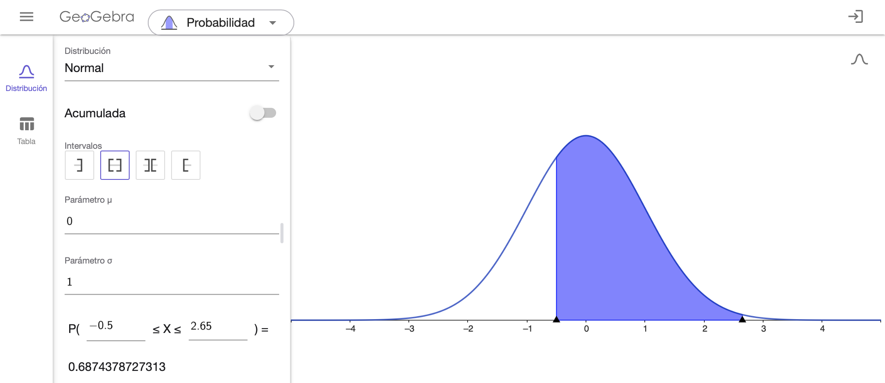
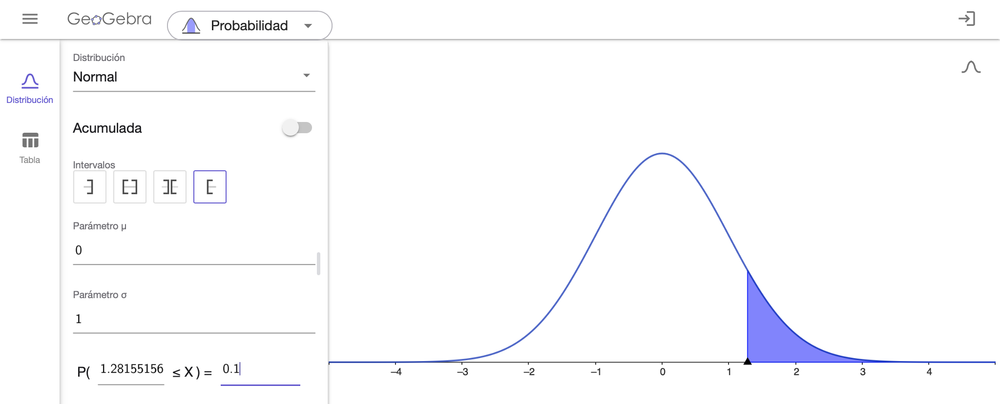
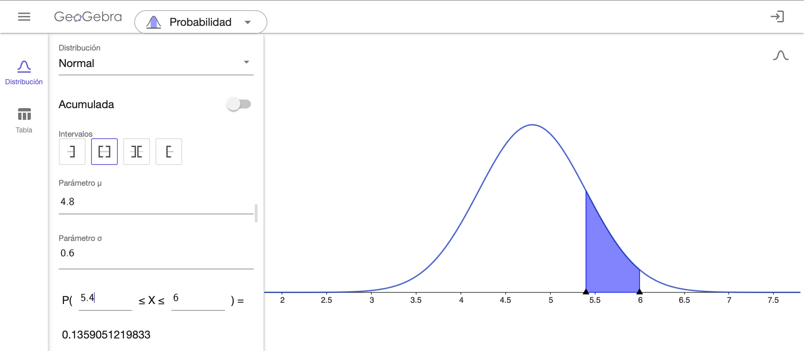

# Análisis Inferencial. Aplicaciones.

En este capítulo se resolverán problemas relativos a:

- Objetivos del estudio, hipótesis de trabajo e hipótesis estadísticas
- Importancia de las distribuciones de probabilidad en el trabajo práctico
- Estimación puntual y por intervalo
- Verificación de las hipótesis de trabajo: contraste de hipótesis

## Pregunta test

En relación a las técnicas de inferencia estadística, elija la afirmación correcta:

a)	La media poblacional es una estimación puntual.
b)	La media muestral es un parámetro.
c)	Sólo se rechaza una hipótesis nula si esta es falsa.
d)	Un intervalo de confianza es una estimación confidencial de un parámetro.
e)	Todo lo anterior es falso

<button onclick="f1()">Respuesta correcta</button>

[Explicación](https://1fjmanzano.github.io/bioestadistica/estimacio%CC%81n-de-para%CC%81metros.-intervalos-de-confianza.html)

## Pregunta test

Un estudio sobre la efectividad de un fármaco llega a la conclusión de que éste es mejor que el placebo con p<0,05 ¿Cuál es la interpretación correcta de este resultado?

a)	Con toda seguridad, el tratamiento es mejor que el placebo.
b)	La probabilidad de que el nuevo tratamiento sea mejor que el placebo es superior al 95%.
c)	El tratamiento es un 95% más efectivo que el placebo.
d)	La probabilidad de que el placebo sea mejor que el nuevo fármaco es menor de 5%.
e)	Si el tratamiento no fuese efectivo, existe menos del 5% de probabilidad de observar unas muestras tan contrarias a dicha hipótesis como las obtenidas.

<button onclick="f1_05()">Respuesta correcta</button>

[Explicación](https://1fjmanzano.github.io/bioestadistica/valor-p.html)

## Pregunta test

En la Distribución Normal:

a) El intervalo $\mu \pm \sigma$  abarca el 68% del área total.
b) El intervalo $\mu \pm 1.96 \sigma$ abarca el 95% del área.
c) El intervalo $\mu \pm 2.6\sigma$ abarca el 99% del área.
d) El intervalo $\mu \pm 2.6\sigma$ NO abarca el 5% del área.
e) Todas son ciertas.

<button onclick="f1_1()">Respuesta correcta</button>

[Explicación1](https://1fjmanzano.github.io/bioestadistica/distribuciones-de-probabilidad.html#distribucio%CC%81n-normal)

[Explicación2](https://youtu.be/wWeogWp_bO8)

## Problema

Sea Z una variable aleatoria normal estándar. Calcula:

**a)** El área encerrada por la función de densidad entre $z=0$ y $z=1.35$

**b)** $P(Z \leq 2)$

**c)** $P(-0:5 \leq  Z \leq 2.65)$

**d)** El valor de z (z > 0) de manera que el área encerrada entre 0 y z sea 0.2. 

**e)** El valor de z tal que la probabilidad de obtener un valor mayor que z sea 0.1.

### Solución

Para resolver estas cuestiones, se puede hacer uso de [la tabla de la Normal Tipificada](https://youtu.be/xCBUdpIUx18), o programas como [Excel© y la app Probability Distributions](https://youtu.be/bTnVHL9yG8o?si=I3fjGEwCmzLlbQrI).

En este caso, vamos a utilizar el recurso [Geogebra: Calculadora de Probabilidad](https://www.geogebra.org/calculator). No tenemos más que introducir los datos y obtendremos las soluciones pedidas. Como el problema hace referencia a la distribución $Z \equiv N(0,1)$, usamos la distribución Normal, como parámetro $\mu$ pondremos 0 y como parámetro $\sigma $ pondremos 1.

**a)** Solución: $P(0 \leq Z \leq 1.35) = 0.4115$

**b)** Solución: $P(Z \leq 2) = 0.9772$

**c)** Solución: $P(-0.5 \leq Z \leq 2.65) = 0.6874$

**d)** Solución: $P(0 \leq Z \leq 0.5244) = 0.2$

En este caso, hemos ido aproximando a 4 decimales hasta obtener el valor más próximo a 0.2.

**e)** Solución: $P(Z \geq 1.2816) = 0.1$

## Pregunta test

Una estimación confidencial para un nivel de confianza fijado, da por respuesta:

a)	Una aproximación de la media.
b)	Una aproximación de una proporción.
c)	Una probabilidad.
d)	Un intervalo.
e)	Un nivel de significación.

<button onclick="f2()">Respuesta correcta</button>

[Explicación](https://1fjmanzano.github.io/bioestadistica/estimacio%CC%81n-de-para%CC%81metros.-intervalos-de-confianza.html)

## Pregunta test

En un contraste de hipótesis la cantidad p es:

a)	Un número pequeño.
b)	Fijada antes de realizar el contraste.
c)	La probabilidad de rechazar la hipótesis nula.
d)	La probabilidad de error al rechazar la hipótesis alternativa.
e)	Conocida al extraer la muestra y calcular el estadístico experimental.

<button onclick="f2_1()">Respuesta correcta</button>

[Explicación](https://1fjmanzano.github.io/bioestadistica/valor-p.html)

## Pregunta test

El perímetro torácico en un grupo de militares presenta distribución gaussiana con 95 cm de media y 5 cm de desviación típica. Elegimos a una muestra de 100 indivíduos y calculamos la media de la misma. Elija la afirmación correcta:

a)	La media de la muestra valdrá 95 cm.
b)	La media de la muestra sería un valor comprendido entre 90 y 100 cm con confianza del 68%.
c)	La media de la muestra será un valor comprendido entre 95 y 100 cm con confianza del 95%.
d)	La media de la muestra será un valor comprendido entre 94 y 96 cm con confianza del 95%.
e)	Todo lo anterior es falso.

<button onclick="f3()">Respuesta correcta</button>

**Explicación** 

Consideramos la variable aleatoria

$X$ = perímetro torácico en un grupo de militares $X \equiv N(95, 5)$

El intervalo de confianza para la media muestral $\overline{x}$ al 95% será:

$\mu \pm z_{\alpha/2} \cdot \frac{\sigma}{\sqrt{n}}$

Para una confianza del 95%, $z_{\alpha/2} = 1.96$ ([ver vídeo](https://youtu.be/wWeogWp_bO8)) de donde:

$\mu \pm z_{\alpha/2} \cdot \frac{\sigma}{\sqrt{n}}= 95 = 95 \pm 1.95 \cdot \frac{5}{\sqrt{100}}= (94.02002,95.97998) \approx (94, 96)$

Se puede comprobar el resultado utilizando el applet [Probability Distributios: Statistical Inference for $\mu$](https://homepage.divms.uiowa.edu/~mbognar/applets/mu.raw.html) introduciendo los valores $n=100$, $\overline{x}=95$ y $\sigma = 5$ con $95$ % de CI (confidence Interval) y activando la opción *Show equations*.

## Pregunta test

El consumo diario de Calorías se distribuye en una población de forma normal, con media 2500 y desviación típica 100. Si elijo una muestra de tamaño 100, entre qué valores espero encontrar su media (con una probabilidad del 95% de acertar):

a)	Entre 2400 y 2600.
b)	Entre 2300 y 2700.
c)	Entre 2490 y 2510.
d)	Entre 2480 y 2520.
e)	Entre 2498 y 2502.

<button onclick="f4()">Respuesta correcta</button>

[Explicación](https://homepage.divms.uiowa.edu/~mbognar/)

## Problema

El nivel de colesterol en la sangre se mide de acuerdo a un índice llamado LDL. Para el caso de personas adultas, la distribución del colesterol en la sangre es aproximadamente normal y en el caso de los hombres tiene una media de $4.8$ unidades LDL con una desviación estándar igual a $0.6$ unidades. El nivel normal (o riesgo normal) de colesterol se considera aquel que queda entre los límites $\mu \pm  \sigma$ en unidades LDL. Una persona con más de $\mu + \sigma$ pero menos de $\mu + 2\sigma $  unidades LDL tiene un nivel de riesgo moderado. Si tiene un nivel de  $\mu + 2\sigma $ o superior se considera de alto riesgo y se hace propenso a sufrir un infarto. Por otra parte, si el nivel de colesterol en la sangre de un adulto está por debajo de $\mu - \sigma$ unidades, se considera de riesgo bajo.

**a)** ¿Cuáles son los porcentajes de población de hombres adultos que están incluidos en cada uno de los 4 niveles de riesgo descritos?

**b)** ¿A partir de qué nivel de colesterol se encuentra el 10 % de la población de hombres adultos con mayor riesgo?

**a)** Los niveles son:

| Riesgo  | Nivel de LDL |
|:-:|:-:|
| Bajo|  $< 4.2$ |
|Normal | $4.2 -5.4$  |
| Moderado | $5.4 -6$  |
| Alto | $> 6$ |

Utilizando la [calculadora de Probabilidad de Geogebra](https://www.geogebra.org/calculator) obtenemos los porcentajes de poblacion:

| Riesgo  | Nivel de LDL | % población |
|:-:|:-:|:-:|
| Bajo|  $< 4.2$ | $15.9 \%$ |
|Normal | $4.2 - 5.4$  | $68.3 \%$ |
| Moderado | $5.4 - 6$  | $13.6 \%$
| Alto | $> 6$ | $2.2 \%$  |

**b)** Siendo $X$ =  nivel de colesterol en la sangre, tenemos que calcular el valor de $x$ para el que $P(X > x) = 0.10$ (normal inversa). Con Geogebra, obtenemos que ese valor es $5.57$.

## Pregunta test

Un contraste de hipótesis se considera significativo si:

a)	Una muestra aleatoria es coherente con la hipótesis nula.
b)	Una muestra aleatoria no es coherente con la hipótesis nula.
c)	La hipótesis alternativa es más probable que la nula.
d)	Todo lo anterior es cierto.
e)	Son ciertas (b) y (c).

<button onclick="f4_1()">Respuesta correcta</button>

[Explicación](https://1fjmanzano.github.io/bioestadistica/contrastes-de-hipo%CC%81tesis.html)

## Pregunta test

En una muestra aleatoria de 100 individuos se obtiene una media muestral de 50, la desviación típica es 20. Elija la afirmación correcta:

a)	El 68% de los individuos de la muestra tiene sus valores comprendidos entre 48 y 52.
b)	El 95% de los individuos de la muestra tiene sus valores comprendidos entre 46 y 54.
c)	Hay una probabilidad del 68% de que la media de la población esté comprendida entre 30 y 70.
d)	Hay una probabilidad del 95% de que la media de la población esté entre 46 y 54.
e)	Todo lo anterior es falso.

<button onclick="f5()">Respuesta correcta</button>

[Explicación](https://homepage.divms.uiowa.edu/~mbognar/)

## Pregunta test

Un contraste de hipótesis se considera no significativo si:

a)	Una muestra aleatoria es coherente con la hipótesis nula.
b)	Una muestra aleatoria no es coherente con la hipótesis nula.
c)	La hipótesis nula es más probable que la alternativa.
d)	Todo lo anterior es cierto.
e)	Son ciertas (a) y (c).

<button onclick="f5_1()">Respuesta correcta</button>

[Explicación](https://1fjmanzano.github.io/bioestadistica/contrastes-de-hipo%CC%81tesis.html)

## Pregunta test

Una muestra aleatoria de 64 pacientes refleja que el presión arterial diastólica media es 150 (DT 16), con distribución aproximadamente normal. Elija la afirmación correcta.

a)	La media de la población está con confianza del 95% entre 134 y 166
b)	La media de la población está con confianza del 68% entre 142 y 158
c)	La media de la población está con confianza del 95% entre 148 y 152
d)	La media de la población está con confianza del 95% entre 146 y 154
e)	El error típico es de 1 punto.

<button onclick="f6()">Respuesta correcta</button>

[Explicación](https://homepage.divms.uiowa.edu/~mbognar/)

## Problema

Para ayudar a la evaluación del pronóstico de pacientes con una determinada enfermedad pulmonar se calculan dos índices, independientes entre sí. Se asume que el primero de los índices se distribuye según una normal $N(120,10)$ y que el segundo se distribuye según una normal $N(15,3)$. Se consideran susceptibles de una revisión más profunda aquellos pacientes que en el primer índice superen el valor 142. También son susceptibles de una revisión más profunda aquellos pacientes que en el segundo índice presenten un valor inferior a 8. ¿Qué porcentaje de pacientes son susceptibles de una revisión más profunda?

### Solución

Definimos los sucesos y calculamos sus probabilidades con [Probability Distributions: Normal Distribution](https://homepage.divms.uiowa.edu/~mbognar/applets/normal.html):

- $A$ = valor superior a 142 en el primer índice $P(A)=0.0139$
- $B$ = valor inferior a 8 en el segundo índice $P(B)=0.00982$

De este modo, los pacientes susceptible de una revisión más profunda serán los del suceso $A \cup B$.

Sabemos que $P(A \cup B)= P(A) + P(B) - P(A \cap B)$. Así, nos falta saber el valor de $P(A \cap B)$ (probabilidad de ser susceptible de una revisión más profunda por los 2 índices).

Nos dicen que los índices son independientes. Entonces 

$P(A \cap B) = P(A) \cdot P(B) = 0.0139 \cdot 0.00982 = 0.000136498$, probabilidad prácticamente nula.

Así, $P(A \cup B)= P(A) + P(B) - P(A \cap B) = 0.0139 + 00982 - 0.000136498 = 0.0235835$.

Entonces, **́el 2.36 % de pacientes  son susceptibles de una revisión más profunda**

## Pregunta test

Qúe propiedad o propiedades caracterizan a una distribución normal tipificada frente a una distribución normal cualquiera:

a)	El área bajo su función de densidad es igual a 1.
b)	Su media es 1 y su desviación típica es 0.
c)	Su rango de valores oscila entre 0 y 3.
d)	Su media es 0 y su desviación típica es 1.
e)	Son ciertas (c) y (d)

<button onclick="f7()">Respuesta correcta</button>

[Explicación](https://1fjmanzano.github.io/bioestadistica/distribuciones-de-probabilidad.html#distribucio%CC%81n-z)

## Pregunta test

En relación con los contrastes de hipótesis, elija la afirmación correcta:

a)	La hipótesis nula es la correcta.
b)	La hipótesis nula es la falsa.
c)	Si la hipótesis alternativa es cierta, seguro que se rechaza la nula.
d)	El contraste es significativo cuando los datos muestrales no son los esperados si la hipótesis nula fuese cierta,
e)	Si es más probable que sea cierta la hipótesis alternativa que la nula, el contraste es significativo.

<button onclick="f7_1()">Respuesta correcta</button>

[Explicación](https://1fjmanzano.github.io/bioestadistica/contrastes-de-hipo%CC%81tesis.html)

## Pregunta test

En una población, el peso tiene media 60 kg y desviación típica 6 Kg. La altura tiene de media 170 cm y desviación 6 cm. Cierto individuo tiene un peso de 70 Kg y altura 180 cm.

a)	La altura tiene un valor más extremo que el peso.
b)	El peso es menos extremo que la altura.
c)	Peso y altura son valores igualmente extremos.
d)	El peso es más extremo que la altura.
e)	La altura es menos extrema que el peso.

<button onclick="f8()">Respuesta correcta</button>

**Explicación**

En este caso debemos comparar valores en 2 variables normales (o gaussianas):

- Peso $\equiv N(60, 6)$ para un valor de 70 kg.
- Altura $\equiv N(170, 6)$ para un valor de 180 cm.

Podemos hacerlo con una tabla ([ver vídeo](https://youtu.be/xCBUdpIUx18)) o usando Excel@ o una app específica. ([ver vídeo](https://youtu.be/rxkPlU1Ud7c)).

Utilizando la aplicación [Probability Distributions: Normal Distribution](https://homepage.divms.uiowa.edu/~mbognar/applets/normal.html), obtenemos la probabilidad de pesar menos de 70 kg:

y la probabilidad de medir menos de 180 cm:

En ambos casos, la probabilidad es $0.95221$

## Pregunta test

El nivel medio de glucemia en una población tiene un comportamiento gausiano con media 150mg/dl, y un coeficiente de variación del 10%. Entre qué valores se situa el 95% de los individuos de la población.

a)	Entre 140 y 160.
b)	Entre 130 y 170.
c)	Entre 120 y 180.
d)	Entre 110 y 190.
e)	Entre 100 y 200.

<button onclick="f9()">Respuesta correcta</button>

**Explicación**

En este caso, nos dan el coeficiente de variación, $CV=\frac{\sigma}{\overline{x}}$. Entonces:

$0.10 = \frac{\sigma}{150} \Rightarrow \sigma = 15$

Así la variable $X$ = nivel medio de glucemia $\equiv N(150, 15)$.

En una distribución normal, el 95% de los datos están en el intervalo $\mu \pm 2  \sigma= 150 \pm 30 = (120,180)$

## Pregunta test

La concentración de calcio se comporta en los mamíferos como una distribución normal de media 10 y desviación típica 2. ¿Con qué frecuencia se encuentran mamíferos con una concentración superior a 14?

a)	95%
b)	68%
c)	50%
d)	5%
e)	2,5%

<button onclick="f10()">Respuesta correcta</button>

**Explicación**

Con [Probability Distributions: Normal Distribution](https://homepage.divms.uiowa.edu/~mbognar/applets/normal.html) tenemos:

## Pregunta test

Se realiza un estudio para saber si dos tratamientos de quimioterapia presentan diferencias en cuanto a la supervivencia de los pacientes. No se encontró diferencia estadísticamente significativa. ¿Cuál de las siguientes razones podrían ser causantes del resultado?

a)	Los tratamientos ofrecen tiempos de supervivencia muy diferentes.
b)	El nivel de significación es demasiado alto.
c)	Las muestras son demasiado numerosas.
d)	Las muestras son demasiado pequeñas.
e)	Nada de lo anterior.

<button onclick="f10_1()">Respuesta correcta</button>

[Explicación](https://1fjmanzano.github.io/bioestadistica/contrastes-de-hipo%CC%81tesis.html)

## Pregunta test

Se realiza un experimento donde nos basaremos en un contraste de hipótesis para tomar una decisión con un nivel de significación del 1%. De las siguientes cuál no es un resultado posible de un contraste de hipótesis:

a)	El experimento no es concluyente.
b)	El experimento permite obtener conclusiones.
c)	Se rechaza la hipótesis nula.
d)	Se rechaza la hipótesis alternativa.
e)	Se acepta la hipótesis alternativa.

<button onclick="f10_2()">Respuesta correcta</button>

[Explicación](https://1fjmanzano.github.io/bioestadistica/contrastes-de-hipo%CC%81tesis.html)

## Pregunta test

El IMC se distribuye en una población de forma normal. El 95% central de los individuos tiene un IMC comprendido entre 20 y 24. Entonces:

a)	La media es 22.
b)	La desviación típica es 1.
c)	La curtosis es cero.
d)	Todas las anteriores son correctas.
e)	Sólo dos de las anteriores son correctas.

<button onclick="f11()">Respuesta correcta</button>

[Explicación](https://1fjmanzano.github.io/bioestadistica/distribuciones-de-probabilidad.html#distribucio%CC%81n-normal)

## Pregunta test

Elija la afirmación **falsa**:

a)	El nivel de significación es normalmente un valor pequeño.
b)	La significación de un contraste es conocida tras analizar los datos.
c)	El nivel de significación de un contraste debe ser fijado antes de analizar los datos.
d)	Un contraste debe ser declarado significativo antes de recoger los datos.
e)	Un contraste es declarado significativo si se obtiene una muestra que discrepa mucho de la hipótesis nula.

<button onclick="f11_1()">Respuesta correcta</button>

[Explicación](https://1fjmanzano.github.io/bioestadistica/contrastes-de-hipo%CC%81tesis.html)

## Problema

El tiempo que los empleados de una oficina tardan en completar una tarea específica sigue una distribución normal con una media de 45 minutos y una desviación típica de 5 minutos. ¿Cuál es el tiempo que separa aproximadamente al 16% más rápido de los empleados del resto?

### Explicación

Este es un problema de distribución normal inversa [Ver vídeo](https://youtu.be/BqGHUqC4cdQ). 

Si utilizamos la aplicación [Probability Distributios: Normal Distribution](https://homepage.divms.uiowa.edu/~mbognar/applets/normal.html) no tenemos más que introducir los valores $\mu = 45$, $\sigma = 5$ y $P(X > x)= 0.16$ para obtener un valor de $x = 49.97229 \approx 50$.

Entonces, **l tiempo que separa aproximadamente al 16% más rápido de los empleados del resto es de 50 minutos**.

## Pregunta test

Los ingresos de un grupo de personas siguen una distribución normal con una media de 50,000 € y una desviación típica de 10,000 €. ¿Cuál es el rango aproximado de ingresos que abarca al 95% de las personas en este grupo?

a	Entre 30,000€ y 70,000€
b	Entre 20,000€ y 80,000€
c	Entre 40,000€ y 60,000€
d	Entre 10,000€ y 90,000€
e	Entre 50,000€ y 100,000€

<button onclick="f12()">Respuesta correcta</button>

[Explicación](https://youtu.be/TjZvZVxItLc)

## Pregunta test

La cantidad de tiempo que los estudiantes tardan en completar un examen sigue una distribución normal con una media de 120 minutos y una desviación típica de 20 minutos. ¿Qué porcentaje de estudiantes termina el examen en menos de 100 minutos?

a)	2.5%
b)	5%
c)	16%
d)	34%
e)	50%

<button onclick="f13()">Respuesta correcta</button>

[Explicación](https://homepage.divms.uiowa.edu/~mbognar/applets/normal.html)

## Pregunta test

Solamente una de las siguientes frases podría alguna vez encontrarse como conclusión de un estudio científico. ¿Cuál es?

a)	El tratamiento produjo un efecto significativamente mayor que el placebo (p=0.75)
b)	El tratamiento produjo un efecto significativamente menor que el placebo (p=0.25)
c)	El tratamiento no produjo un resultado diferente al placebo (p<0.001)
d)	El tratamiento produjo un efecto significativamente menor que el placebo (p=0.99)
e)	Se apreciaban diferencias significativas entre el placebo y el tratamiento (p<0.001)

<button onclick="f13_1()">Respuesta correcta</button>

[Explicación](https://1fjmanzano.github.io/bioestadistica/contrastes-de-hipo%CC%81tesis.html#contrastes-bilaterales-y-unilaterales)

## Pregunta test

En un estudio que investiga la eficacia de una nueva terapia de rehabilitación para pacientes que han sufrido un accidente cerebrovascular, solo una de las siguientes afirmaciones cumple con los criterios de significación estadística. ¿Cuál es?

a)	La nueva terapia no mostró diferencias significativas en la recuperación en comparación con la terapia estándar (p=0.90)
b)	La nueva terapia fue significativamente menos efectiva que la terapia estándar (p=0.14)
c)	La nueva terapia fue significativamente más efectiva que la terapia estándar (p<0.001)
d)	La nueva terapia fue igual de efectiva que la terapia estándar (p=0.51)
e)	La terapia estándar fue significativamente más efectiva que la nueva terapia (p=0.68)

<button onclick="f13_2()">Respuesta correcta</button>

[Explicación](https://1fjmanzano.github.io/bioestadistica/contrastes-de-hipo%CC%81tesis.html#contrastes-bilaterales-y-unilaterales)

## Pregunta test

La duración de las llamadas en un centro de atención al cliente sigue una distribución normal con una media de 8 minutos y una desviación típica de 2 minutos. ¿Cuál es el tiempo que separa aproximadamente al 2.5% de las llamadas más cortas del resto?

a)	2 minutos
b)	4 minutos
c)	6 minutos
d)	10 minutos
e)	12 minutos

<button onclick="f14()">Respuesta correcta</button>

[Explicación](https://homepage.divms.uiowa.edu/~mbognar/applets/normal.html)

## Pregunta test

En un estudio que evalúa la efectividad de la terapia cognitivo-conductual (TCC) en comparación con la terapia de apoyo en el tratamiento de la ansiedad, solo una de las siguientes afirmaciones es correcta según los criterios de significación estadística. ¿Cuál es?

a)	La TCC no mostró diferencias significativas en la reducción de la ansiedad en comparación con la terapia de apoyo (p=0.15)
b)	La TCC fue significativamente más efectiva que la terapia de apoyo en la reducción de la ansiedad (p<0.001)
c)	La terapia de apoyo fue significativamente más efectiva que la TCC en la reducción de la ansiedad (p=0.91)
d)	Ambas terapias fueron igualmente efectivas en la reducción de la ansiedad (p=0.06)
e)	La TCC fue significativamente menos efectiva que la terapia de apoyo en la reducción de la ansiedad (p=0.56)

<button onclick="f14_1()">Respuesta correcta</button>

## Pregunta test

En una población de estudiantes, las calificaciones en matemáticas tienen una media de 75 y una desviación típica de 10, mientras que las calificaciones en ciencias tienen una media de 80 y una desviación típica de 5. Un estudiante obtiene una calificación de 90 en matemáticas y 85 en ciencias. ¿Cuál de las siguientes afirmaciones es correcta?

a)	La calificación de matemáticas es más extrema que la de ciencias.
b)	La calificación de ciencias es más extrema que la de matemáticas.
c)	Las calificaciones de matemáticas y ciencias son igualmente extremas.
d)	La calificación de matemáticas es menos extrema que la de ciencias.
e)	No se pueden comparar ambas calificaciones.

<button onclick="f15()">Respuesta correcta</button>

[Explicación](https://homepage.divms.uiowa.edu/~mbognar/applets/normal.html)
