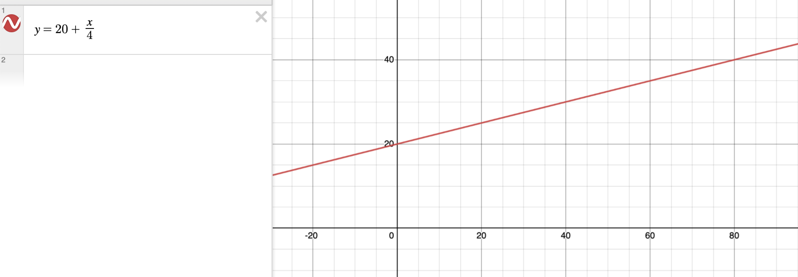
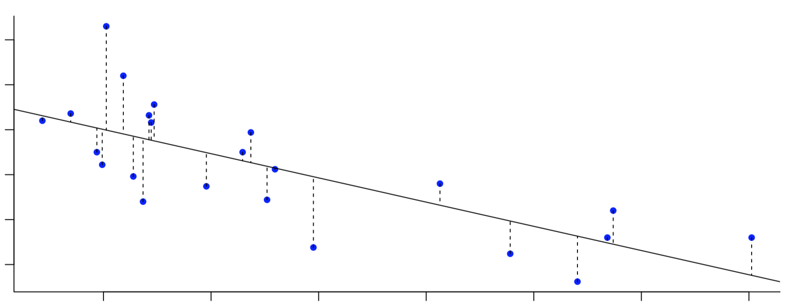
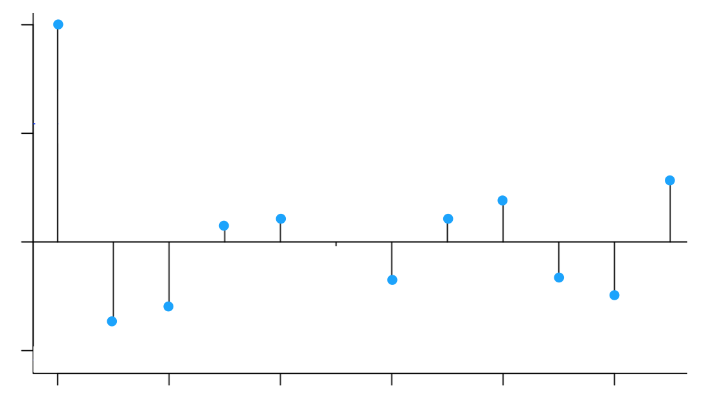

# Regresión y correlación.

En este capítulo se resolverán problemas relativos a:

- Introducción a la regresión y correlación
- Estudio de la representatividad de la recta de regresión
- Otros modelos de regresión
- Correlación

## Pregunta test

Si al calcular el coeficiente de correlación de dos variables X e Y, se tiene r=-0.20 ocurre que:

a)	La pendiente de la recta de regresión es pequeña.
b)	La pendiente de la recta de regresión es grande.
c)	X e Y están poco relacionadas, aunque cuando X decrece, Y tiene tendencia a crecer.
d)	El modelo lineal de regresión explica el 20% de la varianza de una variable cualquiera en función de la otra.
e)	El modelo lineal de regresión explica el 80% de la varianza de una variable cualquiera en función de la otra.

<button onclick="f1()">Respuesta correcta</button>

[Explicación](https://1fjmanzano.github.io/bioestadistica/relaci%C3%B3n-entre-variables-nume%CC%81ricas.html)

## Pregunta test

La recta de regresión de Y sobre X se muestra como un buen modelo para explicar la relación entre dos variables numéricas. Entonces:

a)	Y se puede calcular exactamente como una función matemática de X.
b)	Y es independiente de X.
c)	La covarianza de X e Y no es nula.
d)	La media de X coincide con la media de Y.
e)	Sólo dos de las afirmaciones anteriores son correctas.

<button onclick="f2()">Respuesta correcta</button>

[Explicación](https://1fjmanzano.github.io/bioestadistica/relaci%C3%B3n-entre-variables-nume%CC%81ricas.html#covarianza)

## Pregunta test

En una población se obtiene con una bondad de ajuste de 0,9 que la relación entre nivel de glucemia (Y) y nivel de colesterol (X) es de $Y=20 + \dfrac{X}{4}$. Entonces:

a)	Todos los individuos con un valor de colesterol 100, presentan glucemia 45.
b)	Existe tendencia a que a mayor nivel de glucemia, mayor nivel de colesterol.
c)	Hay mas individuos con colesterol alto que con glucemia baja.
d)	Las observaciones se muestran como una nube de puntos creciente.
e)	Sólo dos de las afirmaciones anteriores son correctas.

<button onclick="f3()">Respuesta correcta</button>

**Explicación**

Tenemos que $r = 0.9$ lo que indica una correlacion lineal positiva y fuerte entre las 2 variables. 

Además, tenemos la ecuación de la recta de regresión de $Y$ (nivel de glucemia) sobre $X$ (nivel de colesterol),  $Y=20 + \dfrac{X}{4}$

Veamos cada apartado:

**a)** Efectivamente, para un valor de colesterol 100, como $Y=20 + \dfrac{100}{4}= 20 + 25 = 45$, se estima que el valor de glucemia es de 45. Pero eso no implica que *todos los individuos* con un valor de colesterol 100, presentan glucemia 45.

**b)** Al haber correlación lineal positiva y fuerte ($r^2=0.9 \Rightarrow r \approx 0.95$), se cumple que existe tendencia a que a mayor nivel de glucemia, mayor nivel de colesterol.

**c)** Con los datos del problema, no podemos saber si hay mas individuos con colesterol alto que con glucemia baja.

**d)** Como la nube de puntos se ajusta bastante bien a la recta de regresión cuya gráfica (obtenida con [Desmos](https://www.desmos.com/calculator?lang=es)) es:

se cumple que las observaciones se muestran como una nube de puntos creciente.

## Pregunta test

Dos variables numéricas son incorreladas. Entonces:

a)	$r = 0$
b)	El modelo lineal de regresión sólo propone un valor como predicción de $Y$.
c)	La nube de puntos no presenta aspecto creciente.
d)	La varianza residual en el modelo de regresión de Y sobre X es igual a la varianza de Y.
e)	Todo lo anterior es cierto.

<button onclick="f4()">Respuesta correcta</button>

**Explicación**

**a)** Si no existe correlación entre las variables (incorreladas), $r=0$. Al mínimo de correlación que haya, $r \neq 0$, tanto positiva como negativa. 

**b)** Siempre se cumple que el modelo lineal de regresión sólo propone un valor como predicción de $Y$. Al obtener la ecuación de la recta de regresión (modelo), para un valor de $X$ únicamente tenemos un valor de $Y$.

**c)** Al no haber correlación, la nube de puntos no presenta tendencia alguna por lo que la nube de puntos no presenta aspecto creciente (ni decreciente).

**d)** Recordamos que, modelo de regresión de Y sobre X, los residuos son las direfencias (en vertical) de los puntos a la recta de regresión, es decir las medidas del los segmentos de la imagen:

Así, la varianza residual en el modelo de regresión de Y sobre X es la media de los cuadrados de esos valores (residuos). Si la recta es oblicua, esos residuos dependen de esa inclinación, esto es, dependen de $X$ e $Y$.

En nuestro caso, las variables son incorreladas por lo que la recta de regresión del modelo de regresión de Y sobre X es horizontal:

De este modo, los residuos dependen únicamente de $Y$. Al pasar la recta de regresión por el punto $(\overline{x}, \overline{y})$, la media de los cuadrados de los residuos coincide con la varianza de $Y$ por lo que, cuando las variables son incorreladas, la varianza residual en el modelo de regresión de Y sobre X es igual a la varianza de Y.

## Pregunta test

De las siguientes parejas de variables, en cuáles crees que puede ser útil un análisis de regresión lineal:

a)	La presión sanguínea y el grupo sanguíneo.
b)	El nivel de colesterol y la concentración de bilirrubina.
c)	El grupos sanguíneo y el factor Rh.
d)	El género y la edad.
e)	Poseer ideología racista y el factor RH.

<button onclick="f5()">Respuesta correcta</button>

[Explicación](https://smiba.org.ar/curso_medico_especialista/lecturas_2021/e%29.%204%20Correlación%20y%20regresión.pdf)

## Prefunta test

Si el coeficiente de correlación lineal de Pearson entre dos variables es $-0,8$ podemos decir:

a)	La covarianza es negativa.
b)	La relación entre las variables es directa.
c)	Hay poca relación lineal entre las variables.
d)	Hay un error de cálculo.
e)	El 80% de las predicciones son correctas.

<button onclick="f6()">Respuesta correcta</button>

[Explicación](https://1fjmanzano.github.io/bioestadistica/relaci%C3%B3n-entre-variables-nume%CC%81ricas.html#coeficiente-de-correlacio%CC%81n)

## Pregunta test

En un estudio de regresión lineal, donde el peso se estudie conjuntamente con otras variables, en qué casos lo usarías como variable dependiente:

a)	Al estudiarlo con la altura.
b)	Al estudiarlo con el nivel del colesterol.
c)	Al estudiarlo con la presión sanguínea.
d)	Al estudiarlo con el grupo sanguíneo.
e)	Nada de lo anterior.

<button onclick="f7()">Respuesta correcta</button>

[Explicación](https://www.cdc.gov/healthyweight/spanish/assessing/bmi/adult_bmi/index.html)

## Pregunta test

En una población formada por unidades familiares, la altura media del padre en la familia se comporta como una distribución normal de media 170 cm con desviación típica 5 cm. La altura del primer hijo varón es otra variable con distribución similar. Con estos datos podemos afirmar:

a)	No hay relación entre ambas variables.
b)	Hay relación inversa entre las variables.
c)	No debemos intentar predecir la altura del hijo de un padre que mide 140 cm.
d)	Hay relación directa entre las variables.
e)	Nada de lo anterior.

<button onclick="f8()">Respuesta correcta</button>

[Explicación](https://www.feedingthemachine.ai/regresion-lineal-y-los-outliers/)

## Pregunta test

Se observa que al aumentar el consumo de estanol, disminuye el nivel de colesterol en sangre. Se utiliza un modelo de regresión lineal donde el nivel de colesterol es la variable independiente y el consumo de estanol es la dependiente. Se calcula una bondad de ajuste para el modelo del 25%. Entonces:

a)	El 25% de las predicciones del modelo son correctas.
b)	$r= 0.5$
c)	$r= 0.25$
d)	$r= -0.25$
e)	$r= -0.5$

<button onclick="f9()">Respuesta correcta</button>

[Explicación](https://blog.minitab.com/es/analisis-de-regresion-como-puedo-interpretar-el-r-cuadrado-y-evaluar-la-bondad-de-ajuste)

## Pregunta test

Si el coeficiente de correlación lineal de Pearson entre dos variables es -0,1 podemos decir:

a)	La covarianza es pequeña.
b)	Hay fuerte relación inversa entre las variables.
c)	Hay poca relación lineal entre las variables.
d)	Hay un error de cálculo.
e)	El 10% de las predicciones son correctas.

<button onclick="f10()">Respuesta correcta</button>

[Explicación](https://1fjmanzano.github.io/bioestadistica/relaci%C3%B3n-entre-variables-nume%CC%81ricas.html#coeficiente-de-correlacio%CC%81n)

## Pregunta test

Se estudia la asociación lineal entre dos variables numéricas. El coeficiente de determinación vale $0,95$.

a)	Hay poca asociación.
b)	Hay asociación directa.
c)	Hay asociación inversa.
d)	Hay una buena asociación
e)	Nada de lo anterior.

<button onclick="f11()">Respuesta correcta</button>

[Explicacion](https://es.wikipedia.org/wiki/Coeficiente_de_determinación)

## Pregunta test

Se observa que al disminuir el consumo de comida rápida, disminuye el nivel de colesterol en sangre. Se usa un modelo de regresión entre ambas que ofrece una bondad de ajuste del 36%. Entonces:

a)	El 36% de las predicciones del modelo son correctas.
b)	$r= +0.60$
c)	$r= +0.36$
d)	$r= -0.60$
e)	$r= -0.36$

<button onclick="f12()">Respuesta correcta</button>

[Explicacion](https://es.wikipedia.org/wiki/Coeficiente_de_determinación)

## Pregunta test

Un modelo de regresión lineal para calcular la glucemia (sangre) a partir de la de la orina (glucosuria) es"glucemia = 20 + 0.5 glucosuria". Si dos personas se diferencian en 10 unidades de glucosuria, cual es la mejor estimación que puede hacer para la diferencia en glucemia:

a)	5
b)	10
c)	15
d)	20
e)	25

<button onclick="f13()">Respuesta correcta</button>

**Explicacion**

El modelo establece que "glucemia = 20 + 0.5 glucosuria". Así, la pendiente (o inclinación) de la recta de regresión es $0.5 = \frac{1}{2}$

De este modo, si dos personas se diferencian en 10 unidades de glucosuria (en horizontal), la variación en glucemia (en vertical según el modelo) será la mitad, es decir, 5.

## Pregunta test

Qué afirmación sobre la covarianza es falsa:

a)	La covarianza es una medida de la variabilidad conjunta de dos variables numéricas.
b)	Si la covarianza es positiva implica una relación creciente entre las variables.
c)	A partir de ella se obtiene el coeficiente de correlació lineal de Pearson.
d)	Posee dimensiones.
e)	Si es 0 podemos afirmar que no existe relación posible entre las variables.

<button onclick="f14()">Respuesta correcta</button>

[Explicacion](https://1fjmanzano.github.io/bioestadistica/relaci%C3%B3n-entre-variables-nume%CC%81ricas.html#covarianza)

## Pregunta test

La pendiente de una recta de una función de regresión lineal es $Y = b_0 + b_1 \cdot X$

a)	Representa el incremento de $Y$ por cada unidad de incremento de $X$.
b)	Tiene el mismo signo que la covarianza.
c)	Es el valor de la variable $Y$ cuando $X=0$.
d)	Todas las anteriores son correctas.
e)	Sólo la a) y la b) son correctas.

<button onclick="f15()">Respuesta correcta</button>

[Explicacion](https://1fjmanzano.github.io/bioestadistica/relaci%C3%B3n-entre-variables-nume%CC%81ricas.html#regresio%CC%81n-lineal)

## Pregunta test

De los siguiente estudios de relación entre variables, en cuál crees que no sería oportuno usar la técnica de regresión lineal.

a)	La presión sanguínea y la acidez (ph).
b)	El número de glóbulos rojos y el grupo sanguíneo
c)	La altura y las horas de sueño.
d)	La edad y el conteo de plaquetas.
e)	El nivel de colesterol y la concentración de bilirrubina.

<button onclick="f16()">Respuesta correcta</button>

[Explicacion](https://es.cochrane.org/es/divulgacion/pensamiento-critico/correlacion-no-implica-causalidad)

## Pregunta test

Después de estudiar la relación existente entre la flexión y la extensión de cuello de los alumnos de la USAL, obtenemos que el valor de la covarianza es $-0,57$. ¿El valor de r saldrá positivo o negativo?

a)	Saldrá positivo porque la relación es inversa.
b)	Saldrá negativo también porque el signo de la covarianza y del coeficiente de correlación lineal de Pearson siempre coinciden.
c)	No podemos saber el signo de r sabiendo la covarianza porque no están relacionados.
d)	Todas las anteriores son falsas.
e)	Necesitamos conocer $R^2$ para saber el signo de r

<button onclick="f17()">Respuesta correcta</button>

[Explicacion](https://1fjmanzano.github.io/bioestadistica/relaci%C3%B3n-entre-variables-nume%CC%81ricas.html#covarianza)

## Pregunta test

Si el coeficiente de correlación lineal de Pearson entre dos variables es $-0,9$ podemos decir que:

a)	La covarianza será positiva.
b)	La relación lineal es buena.
c)	Al ser inferior a 1, la relación lineal es pequeña.
d)	Tenemos una relación lineal inversa, pero no buena.
e)	Sólo dos son correctas.

<button onclick="f18()">Respuesta correcta</button>

[Explicacion](https://1fjmanzano.github.io/bioestadistica/relaci%C3%B3n-entre-variables-nume%CC%81ricas.html#coeficiente-de-correlacio%CC%81n)

## Pregunta test

Cual de las siguientes propiedades de r son correctas:

a)	Es adimensional
b)	Cuanto más cerca esté r de de +1 o -1 mejor será el grado de relación lineal
c)	Las variables son incorreladas cuando r=0
d)	Todas las anteriores son correctas
e)	Son todas incorrectas

<button onclick="f19()">Respuesta correcta</button>

[Explicacion](https://1fjmanzano.github.io/bioestadistica/relaci%C3%B3n-entre-variables-nume%CC%81ricas.html#coeficiente-de-correlacio%CC%81n)

## Pregunta test

Se dice que la relación entre dos variables es directa cuando:

a)	La covarianza es igual a cero
b)	La covarianza es negativa
c)	La covarianza es mayor que cero
d)	El coeficiente de correlación lineal es positivo
e)	Las respuestas c) y d) son correctas

<button onclick="f20()">Respuesta correcta</button>

[Explicacion](https://1fjmanzano.github.io/bioestadistica/relaci%C3%B3n-entre-variables-nume%CC%81ricas.html#coeficiente-de-correlacio%CC%81n)

## Pregunta test

Sabiendo que $r=+0.7$ elija la afirmación falsa.

a)	La covarianza es positiva
b)	Hay cierta relación lineal entre las variables
c)	La bondad de ajuste es 0.14
d)	La nube de puntos es creciente
e)	Existe una relación directa

<button onclick="f21()">Respuesta correcta</button>

[Explicacion](https://blog.minitab.com/es/analisis-de-regresion-como-puedo-interpretar-el-r-cuadrado-y-evaluar-la-bondad-de-ajuste)

## Pregunta test

En un estudio de regresión, ¿cuándo coincidirán los valores de la variable dependiente con los propuestos por el modelo lineal de regresión?

a)	Cuando r tenga un valor positivo
b)	Cuando r sea igual a cero
c)	Nunca, aunque el modelo sea perfecto
d)	Cuando r valga 1 ó -1
e)	Las opciones c) y d) son correctas

<button onclick="f22()">Respuesta correcta</button>

[Explicacion](https://1fjmanzano.github.io/bioestadistica/relaci%C3%B3n-entre-variables-nume%CC%81ricas.html#coeficiente-de-correlacio%CC%81n)

## Pregunta test

Si el coeficiente de correlación lineal de Pearson entre dos variables es $-0,82$, podemos afirmar que:

a)	la relación entre las dos variables es casi nula
b)	la relación que hay entre las variables es muy buena y directa
c)	la covarianza es positiva
d)	la relación que hay entre las variables es muy buena e inversa
e)	sólo dos de las afirmaciones anteriores son correctas

<button onclick="f23()">Respuesta correcta</button>

[Explicacion](https://1fjmanzano.github.io/bioestadistica/relaci%C3%B3n-entre-variables-nume%CC%81ricas.html#coeficiente-de-correlacio%CC%81n)

## Pregunta test

¿Qué otro nombre reciben los diagramas de dispersión?

a)	Diagrama de regresión
b)	Nube de puntos
c)	Diagrama lineal
d)	Diagrama de relación inversa
e)	Diagrama simple

<button onclick="f24()">Respuesta correcta</button>

[Explicacion](https://1fjmanzano.github.io/bioestadistica/relaci%C3%B3n-entre-variables-nume%CC%81ricas.html#diagramas-de-dispersio%CC%81n)

## Pregunta test

Un modelo de regresión lineal para calcular "Fatty liver Index" ($FLI$) a partir del consumo de $aceite$ de oliva es "$FLI=70- 4 \cdot aceite$". Si dos personas se diferencian en 5 unidades de consumo de aceite, cual es la mejor estimación que puede hacer para la diferencia en $FLI$:

a)	5
b)	10
c)	15
d)	20
e)	60

<button onclick="f25()">Respuesta correcta</button>

[Explicacion](https://1fjmanzano.github.io/bioestadistica/relaci%C3%B3n-entre-variables-nume%CC%81ricas.html#regresio%CC%81n-lineal)

## Pregunta test

El porcentaje de variabilidad explicada por un modelo lineal de regresión es 3%.

a)	El modelo lineal de regresión es insuficiente para explicar la variable dependiente.
b)	Las variables son incorreladas.
c)	El error cometido por el modelo lineal de regresión es pequeño, por tanto el ajuste lineal es bueno.
d)	Hay una relación creciente entre las variables.
e)	Todo lo anterior es falso.

<button onclick="f26()">Respuesta correcta</button>

[Explicacion](https://blog.minitab.com/es/analisis-de-regresion-como-puedo-interpretar-el-r-cuadrado-y-evaluar-la-bondad-de-ajuste)

## Pregunta test

Si en un experimento realizado sobre estudiantes voluntarios a los que se coloca en situación de estrés se observa que los cambios en ritmo cardíaco $RC$ (latidos por minuto) se asocian a cambios en la frecuencia de la voz $FV$ (Hz) con una bondad de ajuste del 15% según el modelo $FV = -5 + 3 \cdot RC$, marque la afirmación verdadera.

a)	La relación entre las variables es inversa.
b)	Las variables no presentan ninguna relación.
c)	La voz disminuye su frecuencia en 5Hz.
d)	Por cada aumento de 1 latido por minuto cardíaco, se produce un aumento de 3 Hz en frecuencia de la voz,
e)	Todo lo anterior es falso.

<button onclick="f27()">Respuesta correcta</button>

[Explicacion](https://1fjmanzano.github.io/bioestadistica/relaci%C3%B3n-entre-variables-nume%CC%81ricas.html#regresio%CC%81n-lineal)

## Pregunta test

Un modelo de regresión lineal que relaciona el tiempo de estudio con el promedio obtenido en una prueba tiene una bondad de ajuste del 36%. ¿Qué significa esto en términos de la relación entre el tiempo de estudio y el promedio obtenido?

a)	La relación es muy fuerte y positiva
b)	La relación es muy débil y negativa
c)	La relación es muy fuerte y negativa
d)	La relación es muy débil y positiva
e)	No se puede inferir la relación entre ambas variables a partir de la bondad de ajuste.

<button onclick="f28()">Respuesta correcta</button>

[Explicacion](https://blog.minitab.com/es/analisis-de-regresion-como-puedo-interpretar-el-r-cuadrado-y-evaluar-la-bondad-de-ajuste)

## Pregunta test

¿Cuál de las siguientes medidas estadísticas es la más adecuada para medir la relación entre el peso y la estatura de un grupo de personas?

a)	Rango intercuartílico
b)	Desviación estándar
c)	Coeficiente de variación
d)	Coeficiente de correlación de Pearson
e)	Coeficiente de asimetría

<button onclick="f29()">Respuesta correcta</button>

[Explicacion](https://1fjmanzano.github.io/bioestadistica/relaci%C3%B3n-entre-variables-nume%CC%81ricas.html#coeficiente-de-correlacio%CC%81n)

