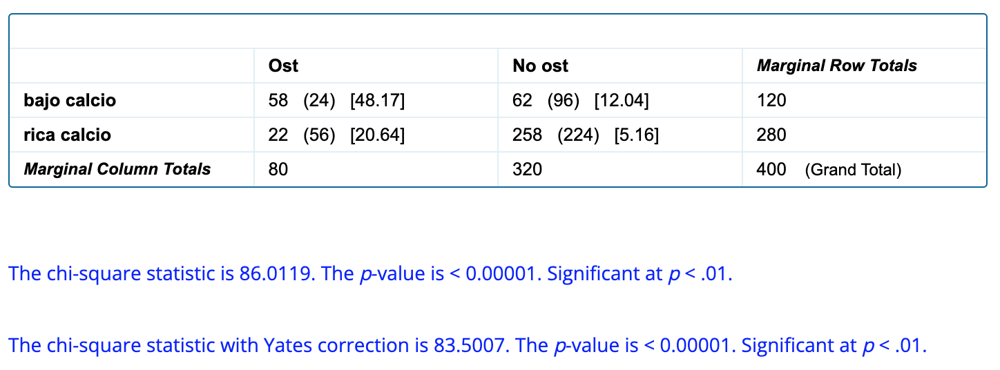
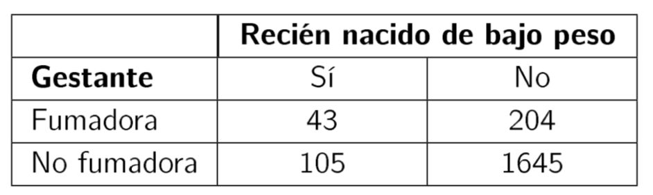
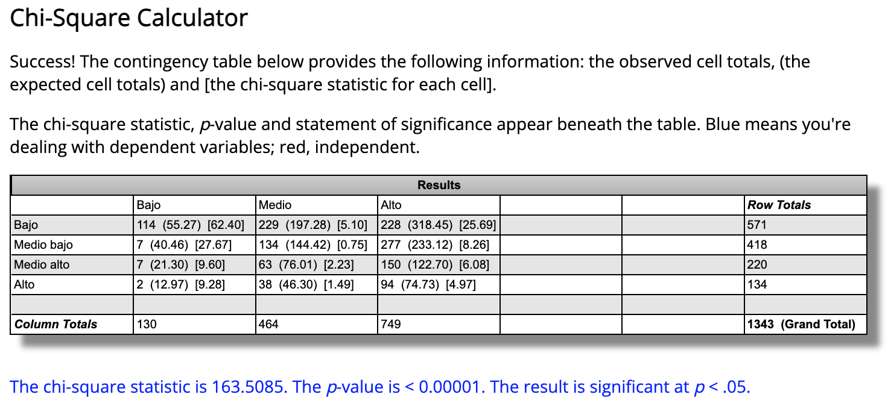
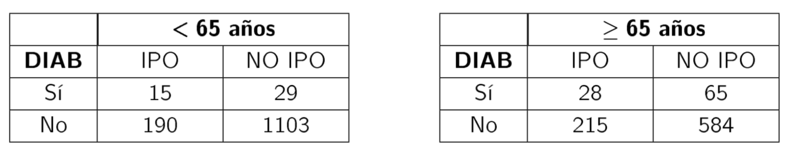

# Tablas de contingencia.

En este capítulo se resolverán problemas relativos a:

- Contrastes de asociación y homogeneidad en tablas bifactoriales
- Coeficientes de asociación

## Problema

Un estudio transversal para conocer la prevalencia de osteoporosis y su relación con algunos factores de riesgo potenciales incluyó a 400 mujeres con edades entre 50 y 54 años. A cada una se le realizó una densitometría de columna y en cada caso se completó un cuestionario de antecedentes. Se pretende determinar si existe una asociación significativa entre la prevalencia de osteoporosis y antecedentes de dieta pobre en calcio. De las 80 pacientes que presentaban osteoporosis 58 presentaban antecedentes de dieta pobre en calcio, en tanto que entre las 320 que no tenían osteoporosis, el número de mujeres con este antecedente era de 62.

**a)** Construye la tabla de contingencia correspondiente y determina, para una nivel de significación del 1 %, si existe una asociación significativa entre la prevalencia de osteoporosis y antecedentes de dieta pobre en calcio.

**b)** Calcula el estadístico Chi-cuadrado corregido (corrección de Yates) y determina en base a ese estadístico si, para un nivel de significación del 5 %, existe una asociación significativa entre la prevalencia de osteoporosis y antecedentes de dieta pobre en calcio.

**c)** Calcula el riesgo relativo.

### Solución

**a)** Incluimos los datos en una tabla de contingencia y la completamos:

|   | Osteoporosis | No osteoporosis |  |
|:-:|:-:|:-:|:-:|
| Dieta pobre en calcio | 58 | 62 | 120 |
| Dieta rica en calcio | 22 | 258 | 280 |
|   | 80  | 320  | 400 |

Establecemos la hipótesis nula y la alternativa:

- $H_0:$ No hay asociación entre las variables (son independientes)
- $H_1:$ Sí hay asociación entre las variables

Ahora, necesitamos calcular el valor del estadístico chi-cuadrado y el valor p asociado para aceptar o rechazar la hipótesis nula. Para ello, podemos utilizar Excel© y seguir las instrucciones de [esta práctica del Curso de Bioestadística](https://1fjmanzano.github.io/bioestadistica/me%CC%81todos-de-inferencia-estadi%CC%81stica.html#prueba-chi2-pr%C3%A1ctica) 

En este caso, vamos a utilizar la calculadora online [Chi-Square Calculator](https://www.socscistatistics.com/tests/chisquare/default2.aspx) que nos da los siguientes resultados:

Así. el valor del estadístico Chi-cuadrado es 86.01 con un valor p asociado < 0.00001. Se rechaza la hipótesis de independencia al 1%: hay relación significativa entre padecer osteoporosis y tener antecedentes de dieta pobre en calcio.

**b)** Nos piden ahora el valor del estadístico Chi-cuadrado corregido (corrección de Yates) para un nivel de significación del 5% (0.05). Obtenemos:

Ahora la corrección de Yates es 83.5. con valor p < 0.00001. Se rechaza la la hipótesis de independencia al 5 % (hay relación significativa)

**c)** Recoradmos que el [Riesgo Relativo](https://es.wikipedia.org/wiki/Riesgo_relativo) es 

$\dfrac{incidencia ~ acumulada ~ en ~ expuestos}{incidencia ~ acumulada ~ en ~ no ~ expuestos}$

En nuestro caso:

$RR = \dfrac{\frac{58}{58+62}}{\frac{22}{22+258}}= 6.15$. 

Así, una mujer con antecedentes de dieta baja en calcio tiene 6 veces más posibilidades de padecer osteoporosis que las que no tienen antecedentes de dieta baja en calcio.

## Pregunta test

Supongamos que se quiere estudiar la posible asociación entre el hecho de que una gestante fume durante el embarazo y que el niño presente bajo peso al nacer. Para responder a esta pregunta se realiza un estudio de seguimiento sobre una cohorte de 2000 gestantes, a las que se interroga sobre su hábito tabáquico durante la gestación y se determina además el peso del recién nacido. Los resultados de este estudio se muestran en la siguiente tabla:

¿Se puede concluir que, con una confianza del 99%, existe una relación estadísticamente significativa entre el hecho de que una gestante fume durante el embarazo y que el niño presente bajo peso al nacer?

a) Sí
b) No

<button onclick="f1()">Respuesta correcta</button>

[Explicación](https://1fjmanzano.github.io/bioestadistica/me%CC%81todos-de-inferencia-estadi%CC%81stica.html#prueba-de-la-chi-cuadrado)

## Pregunta test

## Problema

La siguiente tabla muestra la clasificación de 1343 niños según el grado de cumplimiento de su calendario vacunal y el nivel socio-cultural de sus padres. Determina si existe una asociación significativa entre el grado de cumplimiento del calendario vacunal de los niños y el nivel socio- cultural de sus padres.

### Solución

En este caso necesitamos la [Chi-Square Calculator for 5 x 5 (or less) Contingency Table](https://www.socscistatistics.com/tests/chisquare2/default2.aspx). Cumplimentando la tabla y obteniendo los reslutados con una confianza del 95%:

Así, obtenemos un valor p <0.05 por lo que existe una asociación significativa entre el grado de cumplimiento del calendario vacunal de los niños y el nivel socio- cultural de sus padres.

## Pregunta test

Para evaluar el efecto de la exposición a asbesto sobre el riesgo de fallecer por cáncer de pulmón, un estudio comparó un grupo de 6.245 trabajadores expuestos a este agente con otro grupo de 7.895 trabajadores sin exposición a este factor. A lo largo de 22 años de seguimiento, en el primer grupo se presentaron 76 defunciones por cáncer en el aparato respiratorio, en tanto que en el grupo no expuesto el número de defunciones por esta causa fue 28. ¿Existe una asociación significativa entre la exposición a asbesto y el riesgo de fallecer por cáncer de pulmón?

a) Sí
b) No

<button onclick="f2()">Respuesta correcta</button>

[Explicación](https://1fjmanzano.github.io/bioestadistica/me%CC%81todos-de-inferencia-estadi%CC%81stica.html#prueba-de-la-chi-cuadrado)

## Pregunta test

En un estudio sobre VIH se pretende determinar si existe asociación signi􏰂cativa entre la edad del paciente y el nivel de linfocitos CD4. Para ello se determina el nivel de linfocitos CD4 (<200, 200-500, >500) en pacientes de 3 grupos de edad. ¿Se puede concluir que existe una relación estadísticamente significativa entre el nivel de linfocitos y la edad del paciente?

a) Sí
b) No

<button onclick="f3()">Respuesta correcta</button>

[Explicación](https://1fjmanzano.github.io/bioestadistica/me%CC%81todos-de-inferencia-estadi%CC%81stica.html#prueba-de-la-chi-cuadrado)

## Pregunta test

Se quiere estudiar la posible asociación entre la presencia de infección postoperatoria (IPO) y la diabetes (DIAB) en una población de operados. En una muestra de 1337 personas de edad < 65 años y en otra de 892 de edad $\geq$ 65 años se obtuvieron los siguientes resultados:

¿Existe asociación significativa entre IPO y diabetes en cada grupo de edad?

a) Hay asociación significativa en los dos grupos
b) No hay asociación significativa en ningún grupo
c) la hay para < 65 y no para $\geq$ 65
d) no la hay para < 65 y sí para $\geq$ 65

<button onclick="f4()">Respuesta correcta</button>

[Explicación](https://1fjmanzano.github.io/bioestadistica/me%CC%81todos-de-inferencia-estadi%CC%81stica.html#prueba-de-la-chi-cuadrado)

## Pregunta test

Se realizó un estudio de seguimiento para detectar la posible asociación entre enfermedades cardiovasculares y el exceso de peso. Se eligieron 1990 hombres con edades entre 55 y 59 años de estatura similar. Tras 5 años de seguimiento se observaron los datos resumidos en la tabla. 

¿Se puede admitir que el exceso de peso se asocia con el infarto de miocardio?

a) Sí
b) No

<button onclick="f5()">Respuesta correcta</button>

[Explicación](https://1fjmanzano.github.io/bioestadistica/me%CC%81todos-de-inferencia-estadi%CC%81stica.html#prueba-de-la-chi-cuadrado)

